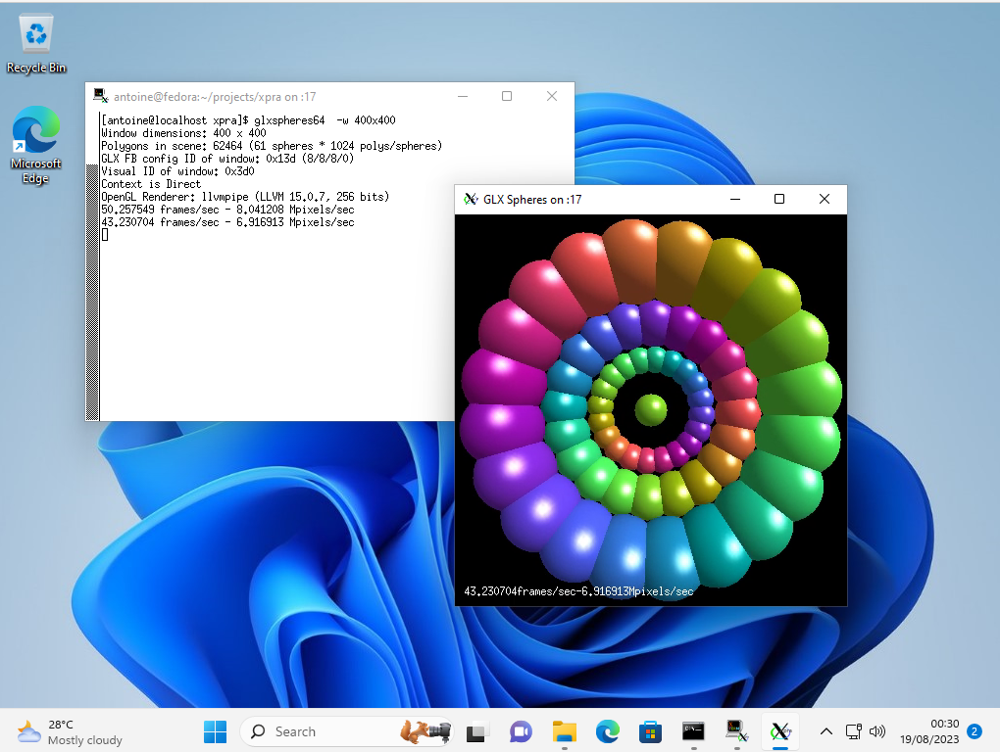

1. [About](#about)
2. [Installation](#installation)
3. [Usage](#usage)
4. [Documentation](#documentation)
5. [Help](#help)

# About
Xpra is known as _"screen for X"_ : its [seamless mode](docs/Usage/Seamless.md) allows you to run X11 programs,
usually on a remote host, direct their display to your local machine,
and then to disconnect from these programs and reconnect from the same or another machine(s),
without losing any state.
Effectively giving you remote access to individual graphical applications.
It can also be used to
[access existing desktop sessions](docs/Usage/Shadow.md) and [start remote desktop sessions](docs/Usage/Desktop.md).

Xpra is _open-source_ ([GPLv2+](COPYING)) with clients available for [many supported platforms](https://github.com/Xpra-org/xpra/wiki/Platforms)
and the server includes a built-in [HTML5 client](https://github.com/Xpra-org/xpra-html5).
Xpra is usable over a wide variety of [network protocols](docs/Network/README.md) and does its best to adapt to any network conditions.

Xpra forwards and synchronizes many extra desktop features which allows remote applications
to integrate transparently into the client's desktop environment:
[audio input and output](docs/Features/Audio.md), [printers](docs/Features/Printing.md), [clipboard](docs/Features/Clipboard.md),
[system trays](docs/Features/System-Tray.md), [notifications](docs/Features/Notifications.md), [webcams](docs/Features/Webcam.md), etc

It can also [open documents and URLs remotely](docs/Features/File-Transfers.md),
display [high bit depth content](docs/Features/Image-Depth.md),
and it will try honour the [display's DPI](docs/Features/DPI.md).

Here's what a seamless session with two windows (an `xterm` and `glxspheres`)
looks like when attached from an MS Windows 11 desktop client:

(the windows may look like native windows, but they are running on a remote Linux server)

---

# Installation
## Official stable downloads
* Microsoft Windows: [EXE](https://xpra.org/stable/windows/Xpra-x86_64_Setup.exe), [ZIP](https://xpra.org/stable/windows/Xpra.zip), [MSI](https://xpra.org/stable/windows/Xpra-x86_64.msi)
* MacOS `x86_64` [DMG](https://xpra.org/stable/MacOS/x86_64/Xpra.dmg) / [PKG](https://xpra.org/stable/MacOS/x86_64/Xpra.pkg), `arm64` [DMG](https://xpra.org/stable/MacOS/arm64/Xpra.dmg) / [PKG](https://xpra.org/stable/MacOS/arm64/Xpra.pkg)
* Linux: [RPM](https://github.com/Xpra-org/xpra/wiki/Download#-for-rpm-distributions), [DEB](https://github.com/Xpra-org/xpra/wiki/Download#-for-debian-based-distributions)

All the packages are signed. There are also [LTS](https://xpra.org/lts) and [beta builds](https://xpra.org/beta) available. \
For more information and more build architecture options, see [xpra downloads](https://github.com/Xpra-org/xpra/wiki/Download)

## Build from source
```sh
git clone https://github.com/Xpra-org/xpra; cd xpra
python3 ./setup.py install
```
For more details, see [building from source](https://github.com/Xpra-org/xpra/tree/master/docs/Build).
To contribute to the project, please try to use pull-requests and follow our [code of conduct](CODE_OF_CONDUCT.md).
Unit test status:
[](https://github.com/Xpra-org/xpra/actions/workflows/test.yml)

---

# Usage
## Initial requirements
`xpra` must be installed on the client and the host.

You can use the [html5 client](https://github.com/Xpra-org/xpra-html5) in which case xpra is only required on the host.

## Seamless Mode
Run `xterm` on a remote host, display and iteract with it locally (from the client machine):
```sh
xpra start ssh://USER@HOST/ --start=xterm
# hint: xterm must be installed on the HOST.
```
For more examples, see [usage](docs/Usage/README.md).

## Shadow
View an existing desktop session running on a remote host:
```sh
xpra shadow ssh://USER@HOST/
```

## Network Access
Xpra servers can support [many different types of connections](docs/Network/README.md) using a single TCP port:
[SSL](docs/Network/SSL.md), [SSH](docs/Network/SSH.md), (secure) http / websockets, RFB, etc..\
Connections can be secured using [encryption](docs/Network/Encryption.md) and [many authentication modules](docs/Usage/Authentication.md).\
Sessions can be automatically announced on LANs using [multicast DNS](docs/Network/Multicast-DNS.md)
so that clients can connect more easily using a GUI (ie: `xpra mdns-gui`).\
Its flexible [proxy server](docs/Usage/Proxy-Server.md) can be used as a relay or front end for multiple server sessions.

---

# Documentation
There is extensive documentation [right here](docs) for the current development version.
This documentation is also included with each release.

For more generic version-agnostic information, checkout [the wiki](https://github.com/Xpra-org/xpra/wiki).

---

# Help
Make sure to check the [FAQ](https://github.com/Xpra-org/xpra/blob/master/docs/FAQ.md), your question may already be answered there.
You can ask your questions on the [github discussions](https://github.com/orgs/Xpra-org/discussions), or on the IRC channel `#xpra` on [`libera.chat`](https://libera.chat)
or [using discord](https://discord.gg/w53cmb34rd).
If you have hit a bug (sorry about that!), please see [reporting bugs](https://github.com/Xpra-org/xpra/wiki/Reporting-Bugs).
