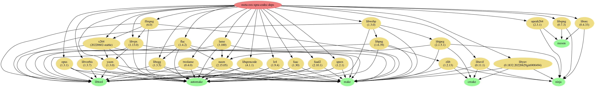
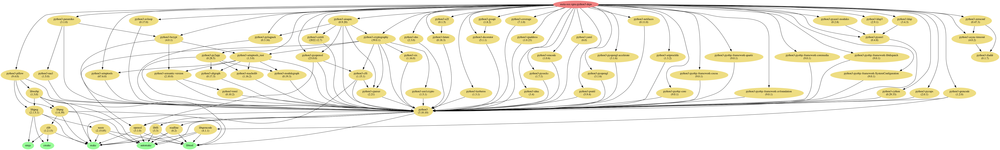
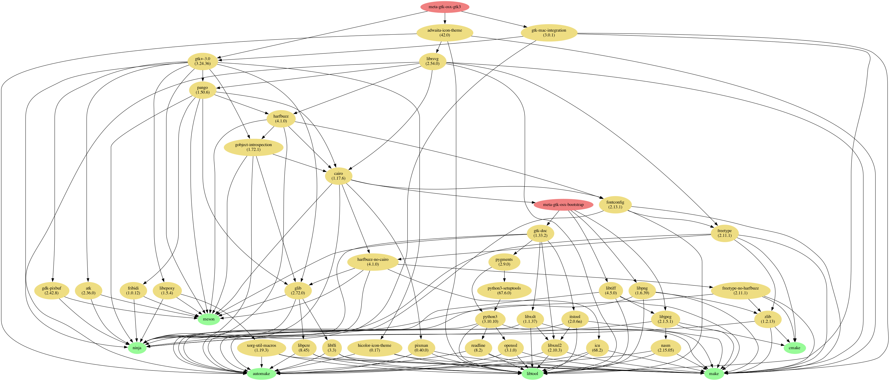
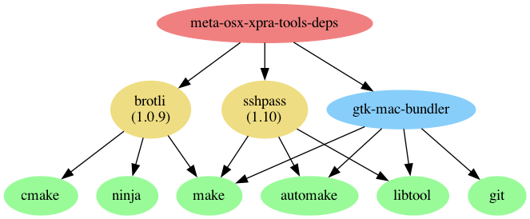
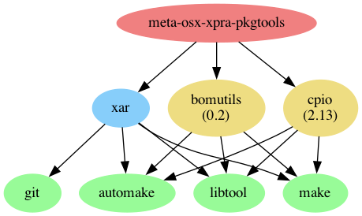

# Dependencies
Most of these dependencies should be installed automatically when you install official packages. \
Unless otherwise stated, the dependencies are all optional.

The tools required for building all of these projects are not listed here. \
Typically, you will need: `gcc` or `clang`, `gnu-make`, `libiconv`, `gettext`, `cmake`, `autoconf`, `automake`, `pkg-config` or `pkgconf`, `bison`, `flex`, `intltool`, etc
For building xpra itself and some of the python modules, you will also need [Cython](https://cython.org/)

  
Core Dependencies

Those are required by almost every component.

| Project                                          | Source Download Link                                                                           | Purpose                                                        | Client or Server | Notes          |
|--------------------------------------------------|------------------------------------------------------------------------------------------------|----------------------------------------------------------------|------------------|:---------------|
| [glib](https://developer.gnome.org/glib/)        | [https://ftp.gnome.org/pub/gnome/sources/glib/](https://ftp.gnome.org/pub/gnome/sources/glib/) | low-level library                                              | both             | Required       |
| [gtk](http://www.gtk.org/)                       | http://ftp.gnome.org/pub/gnome/sources/gtk+/                                                   | UI Toolkit                                                     | both             | Required _(*)_ |
| [PyGObject](https://pypi.org/project/PyGObject/) | [https://pypi.org/project/PyGObject/#files](https://pypi.org/project/PyGObject/#files)         | Bindings for GObject based libraries such as GTK and GStreamer | both             | Required _(*)_ |

_(*)_ needed for running any kind of server, or GUI clients.
It is not required for running text-only clients like `xpra top` or `xpra info`.

And some of their transitive dependencies:

| Project                                                                        | Source Download Link                                            | Purpose                              |
|--------------------------------------------------------------------------------|-----------------------------------------------------------------|--------------------------------------|
| [gobject-introspection](https://gitlab.gnome.org/GNOME/gobject-introspection/) | https://gitlab.gnome.org/GNOME/gobject-introspection/-/releases | Provides bindings for Gtk, GLib, etc |
| [librsvg](https://gitlab.gnome.org/GNOME/librsvg/)                             | https://gitlab.gnome.org/GNOME/librsvg/-/releases               | `svg` parsing                        |
| [freetype](https://github.com/freetype/freetype/)                              | https://freetype.org/download.html                              | font parsing                         |
| [harfbuzzz](https://github.com/harfbuzz/harfbuzz)                              | https://github.com/harfbuzz/harfbuzz/releases                   | text shaping engine                  |
| [icu](https://github.com/unicode-org/icu)                                      | https://github.com/unicode-org/icu/releases                     | unicode library                      |
| [pixman](https://www.pixman.org/)                                              | https://www.cairographics.org/releases/                         | pixel manipulation                   |
| [fribidi](https://github.com/fribidi/fribidi)                                  | https://github.com/fribidi/fribidi/releases                     | unicode bidirectional library        |
| [pango](https://pango.gnome.org/)                                              | https://download.gnome.org/sources/pango/                       | text layout and rendering            |
| [gdk-pixbuf](https://gitlab.gnome.org/GNOME/gdk-pixbuf)                        | https://gitlab.gnome.org/GNOME/gdk-pixbuf/-/releases            | image library                        |
| [libepoxy](https://github.com/anholt/libepoxy/)                                | https://github.com/anholt/libepoxy/releases                     | OpenGL function pointer management   |
| [graphene](https://github.com/ebassi/graphene)                                 | https://github.com/ebassi/graphene/releases                     | types for graphic libraries          |
| [libtiff](http://www.libtiff.org/)                                             | https://download.osgeo.org/libtiff/                             | Tag Image File Format                |
| [zlib](https://www.zlib.net/)                                                  | https://www.zlib.net/                                           | Compression Library                  |

Some of the transitive dependencies are listed separately below as they are direct dependencies of xpra itself.
ie: `lz4`, `libpng`, etc..

  
Network Layer

See [Network](../Network/README.md)

| Project                                                            | Source Download Link                                    | Purpose                                                        | Client or Server    | Notes                                                |
|--------------------------------------------------------------------|---------------------------------------------------------|----------------------------------------------------------------|---------------------|:-----------------------------------------------------|
| [lz4](https://github.com/lz4/lz4)                                  | https://github.com/lz4/lz4/releases                     | [packet compression](PacketEncoding)                           | both                | Strongly recommended                                 |
| [aioquic](https://github.com/aiortc/aioquic)                       | https://pypi.org/project/aioquic/                       | low level network protocol                                     | both                | [quic](https://github.com/Xpra-org/xpra/issues/3376) |
| [python-cryptography](https://cryptography.io/en/latest/)          | https://pypi.python.org/pypi/cryptography               | [Encryption](Encryption)                                       | both                |                                                      |
| [pyopenssl](https://github.com/pyca/pyopenssl)                     | https://pypi.org/project/pyOpenSSL/                     | [Encryption](Encryption)                                       | both                |                                                      |
| [python-zeroconf](https://github.com/jstasiak/python-zeroconf)     | https://pypi.org/project/zeroconf/                      | [Multicast DNS](Multicast-DNS) session publishing and browsing | both                |                                                      |
| [python-netifaces](http://alastairs-place.net/projects/netifaces/) | https://pypi.python.org/pypi/netifaces                  | [Multicast DNS](Multicast-DNS) session publishing              | server              |                                                      |
| [dbus-python](https://pypi.python.org/pypi/dbus-python/)           | https://dbus.freedesktop.org/releases/dbus-python/      | desktop integration, server control interface                  | both                | not applicable to MS Windows or Mac OSX              |
| [openssl](https://www.openssl.org/)                                | https://www.openssl.org/source/                         | [SSL](SSL)                                                     | both                |                                                      |
| [paramiko](https://pypi.org/project/paramiko/)                     | https://pypi.org/project/paramiko/                      | [ssh integration](SSH.md)                                      | both                |                                                      |
| [sshpass](https://sourceforge.net/projects/sshpass/)               | https://sourceforge.net/projects/sshpass/files/sshpass/ | non-interactive SSH password authentication                    | usually client      |                                                      |
| [brotli](https://github.com/google/brotli)                         | https://github.com/google/brotli/releases               | HTML client compression                                        | r15540              |
| [PySocks](https://github.com/Anorov/PySocks)                       | https://github.com/Anorov/PySocks/releases              | client                                                         | SOCKS proxy support | https://github.com/Xpra-org/xpra/issues/2105         |

  
Authentication

See [authentication modules](../Usage/Authentication.md)

| Project                                                    | Source Download Link                  | Purpose  | Client or Server | Notes                                                 |
|------------------------------------------------------------|---------------------------------------|----------|------------------|:------------------------------------------------------|
| [python-gssapi](https://github.com/sigmaris/python-gssapi) | https://pypi.org/project/gssapi/      | GSSAPI   | server           | [#1691](https://github.com/Xpra-org/xpra/issues/1691) |
| [python-kerberos](https://github.com/apple/ccs-pykerberos) | https://pypi.org/project/kerberos/    | Kerberos | server           | [#1691](https://github.com/Xpra-org/xpra/issues/1691) |
| [python-ldap](https://www.python-ldap.org)                 | https://pypi.org/project/python-ldap/ | LDAP     | server           | [#1691](https://github.com/Xpra-org/xpra/issues/1691) |
| [python-ldap3](https://github.com/cannatag/ldap3)          | https://pypi.org/project/ldap3/       | LDAP v3  | server           | [#1691](https://github.com/Xpra-org/xpra/issues/1691) |
| [pyu2f](https://github.com/google/pyu2f)                   | https://pypi.org/project/pyu2f/       | U2F      | server           | [#1789](https://github.com/Xpra-org/xpra/issues/1789) |

  
Python modules

| Project                                                   | Source Download Link                                                                                          | Notes                                                |
|-----------------------------------------------------------|---------------------------------------------------------------------------------------------------------------|:-----------------------------------------------------|
| [Cython](https://cython.org/)                             | https://pypi.org/project/Cython/#files                                                                        | build time: C extensions for Python                  |
| [python-ipaddress](https://github.com/phihag/ipaddress)   | https://pypi.org/project/ipaddress/#files                                                                     | unspecified: r11859                                  |
| [python-idna](https://github.com/kjd/idna)                | https://pypi.org/project/idna/#files                                                                          | unspecified: r11860                                  |
| [python-decorator](https://github.com/micheles/decorator) | https://pypi.org/project/decorator/#files                                                                     | required by gssapi: r18781                           |
| [pyasn1](https://github.com/etingof/pyasn1)               | https://pypi.org/project/pyasn1/#files                                                                        | unspecified: r5829                                   |
| [asn1crypto](https://github.com/wbond/asn1crypto)         | https://pypi.org/project/asn1crypto/#files                                                                    | required by python-cryptography: r17856              |
| [python-packaging](https://github.com/pypa/packaging)     | https://pypi.org/project/packaging/#files                                                                     | required by python-cryptography: r15310              |
| [pyparsing](https://github.com/pyparsing/pyparsing/)      | https://pypi.org/project/pyparsing/#files                                                                     | required by python-cryptography: r15310              |
| [cffi](https://cffi.readthedocs.io/en/latest/)            | https://pypi.org/project/cffi/#files                                                                          | required by python-cryptography: r11633              |
| [six](https://github.com/benjaminp/six)                   | https://pypi.org/project/six/#files                                                                           | required by python-cryptography: r11640              |
| [setuptools](https://github.com/pypa/setuptools)          | https://pypi.org/project/setuptools/#files                                                                    | unspecified: r5829                                   |
| [pycparser](https://github.com/eliben/pycparser)          | https://pypi.org/project/pycparser/#files                                                                     | required by cffi: r11634                             |
| [pynacl](https://github.com/pyca/pynacl/)                 | https://pypi.org/project/PyNaCl/#files                                                                        | crypto library used by paramiko: r19967              |
| [bcrypt](https://github.com/pyca/bcrypt/)                 | https://pypi.org/project/bcrypt/#files                                                                        | crypto library used by paramiko: r19965              |
| [pyopengl](http://pyopengl.sourceforge.net/)              | https://pypi.python.org/pypi/PyOpenGL#files and   https://pypi.python.org/pypi/PyOpenGL-accelerate#files | [client OpenGL accelerated rendering](Client-OpenGL) |
| [pycups](https://github.com/zdohnal/pycups)               | https://pypi.org/project/pycups/#files                                                                        | [Printing](Printing)                                 |

  
Encodings

See [picture encodings](../Usage/Encodings.md)

| Project                                                                            | Source Download Link                                                                                | Purpose                                                               | Client or Server |
|------------------------------------------------------------------------------------|-----------------------------------------------------------------------------------------------------|-----------------------------------------------------------------------|------------------|
| [x264](http://www.videolan.org/developers/x264.html)                               | ftp://ftp.videolan.org/pub/x264/snapshots/                                                          | h264 encoding                                                         | server           |
| [openh264](https://github.com/cisco/openh264)                                      | https://github.com/cisco/openh264/releases                                                          | h264 encoding and decoding                                            | both             |
| [vpx]([http://www.webmproject.org/tools/](https://github.com/webmproject/libvpx/)) | [http://downloads.webmproject.org/releases/webm/index.html](https://github.com/webmproject/libvpx/) | vp8 and vp9 codecs                                                    | both             |
| [webp](https://code.google.com/p/webp/)                                            | http://downloads.webmproject.org/releases/webp/index.html                                           | webp codec                                                            | both             |
| [libpng](http://www.libpng.org/pub/png/libpng.html)                                | ftp://ftp.simplesystems.org/pub/libpng/png/src/libpng16/                                            | png encoding                                                          | both             |
| [libspng](https://libspng.org)                                                     | https://libspng.org/download/                                                                       | faster png encoding                                                   | both             |
| [libjpeg-turbo](https://github.com/libjpeg-turbo/libjpeg-turbo)                    | https://sourceforge.net/projects/libjpeg-turbo/files/                                               | jpeg encoding                                                         | both             |
| [python-pillow](https://python-pillow.github.io/)                                  | https://pypi.python.org/pypi/Pillow                                                                 | png,jpeg,webp encoding and decoding, format conversion - **Required** | both             |
| [libavif](https://github.com/AOMediaCodec/libavif)                                 | https://github.com/AOMediaCodec/libavif/releases                                                    | avif encoding and decoding                                            | both             |
| [libyuv](https://chromium.googlesource.com/libyuv/libyuv/)                         | https://chromium.googlesource.com/libyuv/libyuv/                                                    | [Colourspace Conversion](CSC)                                         | both             |
| [pycuda](https://mathema.tician.de/software/pycuda/)                               | https://pypi.python.org/pypi/pycuda                                                                 | [NVENC](NVENC)                                                        | server           |
| [cuda](http://www.nvidia.com/object/cuda_home_new.html)                            | https://developer.nvidia.com/cuda-toolkit                                                           | [NVENC](NVENC)                                                        | server           |
| [pyNVML](http://pythonhosted.org/nvidia-ml-py/)                                    | https://pypi.python.org/pypi/nvidia-ml-py/                                                          | [NVENC](NVENC)                                                        | server           |

  
Audio

See [audio forwarding](../Features/Audio.md)

| Project                                        | Source Download Link                                   | Purpose              |
|------------------------------------------------|--------------------------------------------------------|----------------------|
| [gstreamer](http://gstreamer.freedesktop.org/) | http://gstreamer.freedesktop.org/src/                  | audio framework      |
| [Ogg](http://xiph.org/ogg/)                    | http://downloads.xiph.org/releases/ogg/                | ogg container format |
| [opus](https://www.opus-codec.org/)            | http://downloads.xiph.org/releases/opus/               | opus codec           |
| [Flac](https://xiph.org/flac/)                 | http://downloads.xiph.org/releases/flac/               | flac codec           |
| [Vorbis](http://www.vorbis.com/)               | http://downloads.xiph.org/releases/vorbis/             | vorbis codec         |
| [wavpack](http://www.wavpack.com/)             | http://www.wavpack.com/downloads.html                  | wavpack codec        |
| [faac](https://github.com/knik0/faac)          | https://github.com/knik0/faac/releases                 | aac encoder          |
| [faad](https://github.com/knik0/faad2)         | https://github.com/knik0/faad2/releases                | aac decoder          |
| [lame](http://lame.sourceforge.net/)           | http://sourceforge.net/projects/lame/files/lame/       | MP3 encoder          |
| [TwoLame](http://www.twolame.org/)             | http://sourceforge.net/projects/twolame/files/twolame/ | MP3 encoder          |

  
Dependency Graphs

  These graphs were generated using `jhbuild dot` on MacOS.
  The MacOS builds include very low level build dependencies.

  ### Codecs
  

  ### Python3 Modules
  

  ### GTK3
  

  ### Tools
  

  ### MacOS Packaging Tools
  

