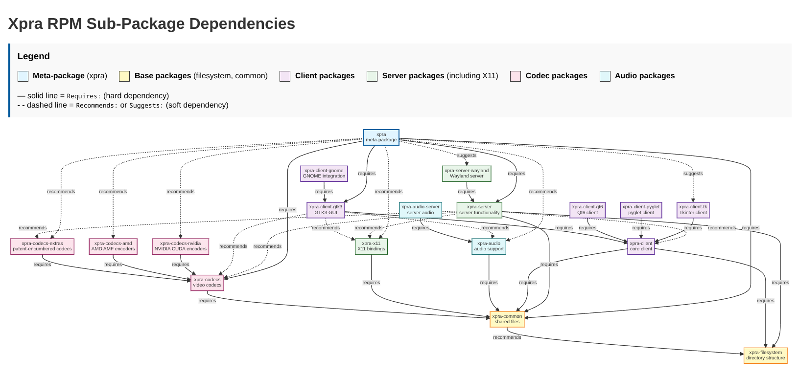

# Packaging

Starting with version 6, xpra packages make extensive use of sub-packages.
This allows users to install only the components they need, drastically reducing the number of packages installed,
saving disk-space and reducing the attack surface.
It also allows multiple versions of xpra to be installed in parallel on the same system,
as long as each one uses a different python interpreter.

For example:
* Wayland clients no longer need to install the `xpra-x11` component
* `xpra-client` (default `python3.12` interpreter) and `python3.10-xpra-client` can coexist on Fedora
* installations that do not use network connections can omit all `xpra-codecs*` packages
* pure server installations no longer need to install the `xpra-client-gtk3` package and its dependencies

---

Assuming that the https://xpra.org/ repositories are installed correctly,
installing `xpra` using your package manager should install the client and server components as well as most picture codecs and audio support.
For slimmer installations, you may also want to use `apt`'s `--no-install-recommends` or `dnf`'s `--setopt=install_weak_deps=False` and select individual xpra sub-packages:

| Package                            | Details                                                                                                                                                                                |
|------------------------------------|----------------------------------------------------------------------------------------------------------------------------------------------------------------------------------------|
| <nobr>`xpra-filesystem`</nobr>     | this package contains configuration files and is independent of the python version See [multiple python targets](https://github.com/Xpra-org/xpra/issues/3945) (version 6 onwards) |
| <nobr>`xpra-common`</nobr>         | this package is required by all the other sub-packages                                                                                                                                 |
| <nobr>`xpra-client`</nobr>         | console clients: `xpra stop`, `xpra info`, etc                                                                                                                                         |
| <nobr>`xpra-client-gtk3`</nobr>    | the main client GUI for connecting to sessions: `xpra attach`, `xpra launcher`, etc                                                                                                    |
| <nobr>`xpra-server`</nobr>         | for starting sessions locally: `xpra seamless`, `xpra desktop`, `xpra shadow`, etc                                                                                                     |
| <nobr>`xpra-server-wayland`</nobr> | experimental Wayland seamless server: `xpra seamless --backend=wayland`                                                                                                                |
| <nobr>`xpra-x11`</nobr>            | required for all X11 server session types (ie: `xpra seamless` and `xpra desktop`) and for X11 clients                                                                                 |
| <nobr>`xpra-audio`</nobr>          | audio forwarding support for both client and server                                                                                                                                    |
| <nobr>`xpra-codecs`</nobr>         | core picture compression codecs                                                                                                                                                        |
| <nobr>`xpra-codecs-extras`</nobr>  | more video compression codecs with heavier footprint and / or licensing requirements                                                                                                   |
| <nobr>`xpra-codecs-amd`</nobr>     | extra proprietary AMD codecs: `amf` encoder                                                                                                                                            |
| <nobr>`xpra-codecs-nvidia`</nobr>  | extra proprietary NVidia codecs: `nvenc`, `nvjpeg`, `nvdec`, `nvfbc`, etc                                                                                                              |

Here is a visual representation of the dependencies between the sub-packages:

---

Please avoid [broken downstream distribution packages](https://github.com/Xpra-org/xpra/wiki/Distribution-Packages).
