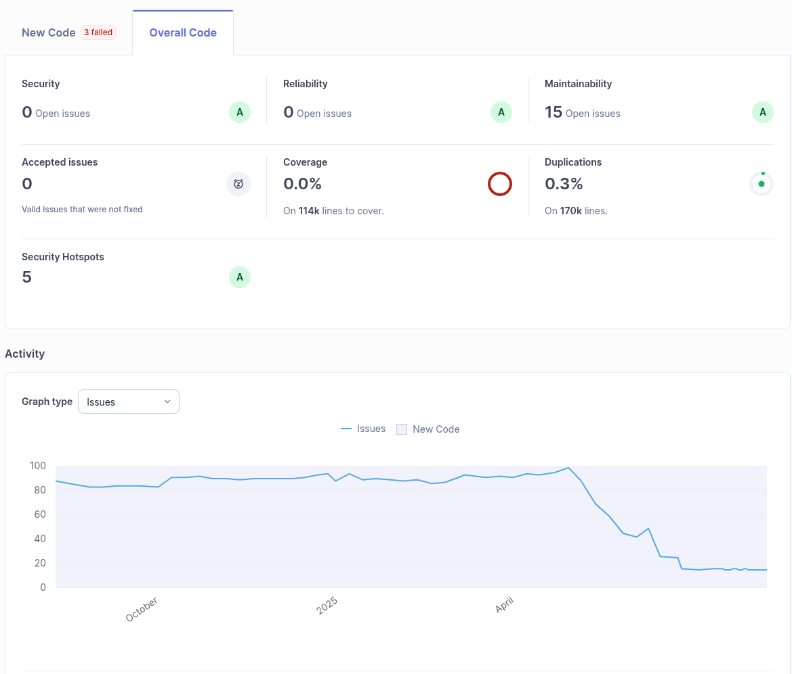

# Source Code Information

See also [dependencies](./Dependencies.md).

These statistics do not include the build or packaging files.

The binary package sizes vary widely, see for example [lightweight win32 installations](https://github.com/Xpra-org/xpra/issues/4100).


# Metrics

## Python

Excluding test folders.
```shell
find xpra -type f -name "*.py" | wc -l
find xpra -type f -name "*.py" -exec cat {} \; | wc -l

```

| Branch | File Count | Line Count |
|--------|------------|------------|
| master | 737        | 163801     |
| v6.3.x | 647        | 159032     |
| v5.1.x | 573        | 147212     |


## Cython `.pyx`

| Branch | File Count | Line Count |
|--------|------------|------------|
| master | 84         | 30960      |
| v6.3.x | 70         | 30485      |
| v5.1.x | 69         | 30350      |


## Copyrights

| Holder                                          | File Count |
|-------------------------------------------------|------------|
| Andrew Resch <andrewresch@gmail.com>            | 1          |
| Antoine Martin <antoine@xpra.org>               | 797        |
| Arthur Huillet                                  | 37         |
| Yusuke Shinyama                                 | 1          |
| Chris Marchetti <adamnew123456@gmail.com>       | 1          |
| Daniel Woodhouse                                | 1          |
| eryksun                                         | 1          |
| Jeremy Lainé                                    | 1          |
| Joel Martin                                     | 1          |
| Markus Pointner                                 | 1          |
| mjharkin                                        | 2          |
| Nathalie Casati <nat@yuka.ch>                   | 1          |
| Nathaniel McCallum <nathaniel@natemccallum.com> | 1          |
| Nathaniel Smith <njs@pobox.com>                 | 150        |
| Pierre Ossman                                   | 1          |


---

# Quality

# Sonarqube:

Updated 2025-08-13

The code coverage is not currently recorded by sonarqube.

## Github Workflows

The [unit tests](https://github.com/Xpra-org/xpra/tree/master/tests/unittests)
are run with every `git push` via [`test.yml`](https://github.com/Xpra-org/xpra/blob/master/.github/workflows/test.yml).

The source code is also compiled with [extra cythonization](https://github.com/Xpra-org/xpra/issues/3978)
which takes advantage of type hints to verify stronger type safety.


## Other linters used

* `pycharm` builtin linter, during development
* `ruff` via a [git pre-commit hook](https://github.com/Xpra-org/xpra/blob/master/.pre-commit-config.yaml)
