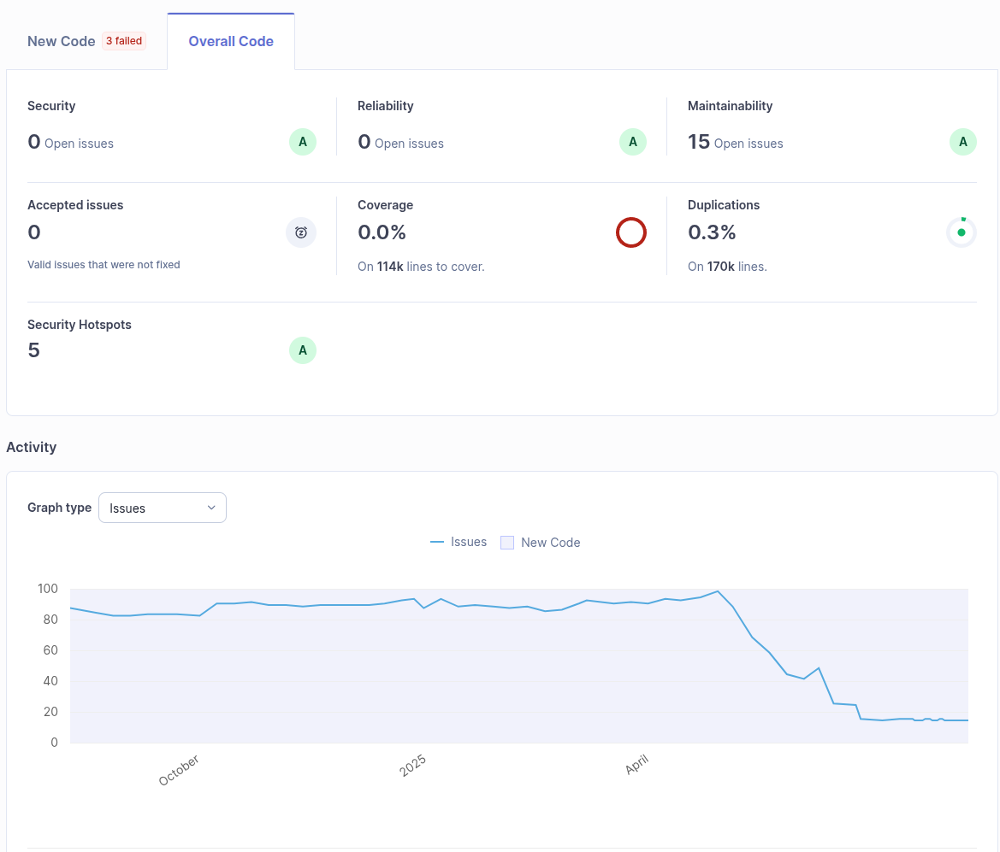

# Source Code Information

See also [dependencies](./Dependencies.md).

These statistics do not include the build or packaging files.

The binary package sizes vary widely, see for example [lightweight win32 installations](https://github.com/Xpra-org/xpra/issues/4100).

# Metrics

| Ref | Branch Date | Files | SLOC | Py Files | Py SLOC | Pyx Files | Pyx SLOC | Modules | Codecs | Commits Since Base |
| --- | --- | ---: | ---: | ---: | ---: | ---: | ---: | ---: | ---: | ---: |
| master | 2026-06-05 | 1,072 | 191,654 | 909 | 150,088 | 106 | 30,793 | 1,015 | 38 | 0 |
| v6.5.x | 2026-05-14 | 994 | 177,593 | 852 | 144,087 | 98 | 28,230 | 950 | 32 | 1 |
| v6.4.x | 2026-01-28 | 905 | 165,635 | 780 | 134,818 | 90 | 26,542 | 870 | 31 | 122 |
| v5.1.x | 2026-05-12 | 672 | 150,079 | 571 | 120,846 | 69 | 24,826 | 640 | 31 | 1,445 |
| v3.1.x | 2024-07-18 | 575 | 124,452 | 491 | 101,459 | 52 | 19,828 | 543 | 19 | 2,130 |
| v1.0.x | 2021-02-12 | 373 | 78,116 | 320 | 64,215 | 37 | 13,675 | 357 | 20 | 777 |

## Copyrights

| Holder                                          | File Count |
|-------------------------------------------------|------------|
| Andrew Resch <andrewresch@gmail.com>            | 1          |
| Antoine Martin <antoine@xpra.org>               | 797        |
| Arthur Huillet                                  | 37         |
| Yusuke Shinyama                                 | 1          |
| Chris Marchetti <adamnew123456@gmail.com>       | 1          |
| Daniel Woodhouse                                | 1          |
| eryksun                                         | 1          |
| Jeremy Lainé                                    | 1          |
| Joel Martin                                     | 1          |
| Markus Pointner                                 | 1          |
| mjharkin                                        | 2          |
| Nathalie Casati <nat@yuka.ch>                   | 1          |
| Nathaniel McCallum <nathaniel@natemccallum.com> | 1          |
| Nathaniel Smith <njs@pobox.com>                 | 150        |
| Pierre Ossman                                   | 1          |

---

# Quality

# Sonarqube:

Updated 2025-08-13

The code coverage is not currently recorded by sonarqube.

## Github Workflows

The [unit tests](https://github.com/Xpra-org/xpra/tree/master/tests/unittests)
are run with every `git push` via [`test.yml`](https://github.com/Xpra-org/xpra/blob/master/.github/workflows/test.yml).

The source code is also compiled with [extra cythonization](https://github.com/Xpra-org/xpra/issues/3978)
which takes advantage of type hints to verify stronger type safety.

## Other linters used

* `pycharm` builtin linter, during development
* `ruff` via a [git pre-commit hook](https://github.com/Xpra-org/xpra/blob/master/.pre-commit-config.yaml)
