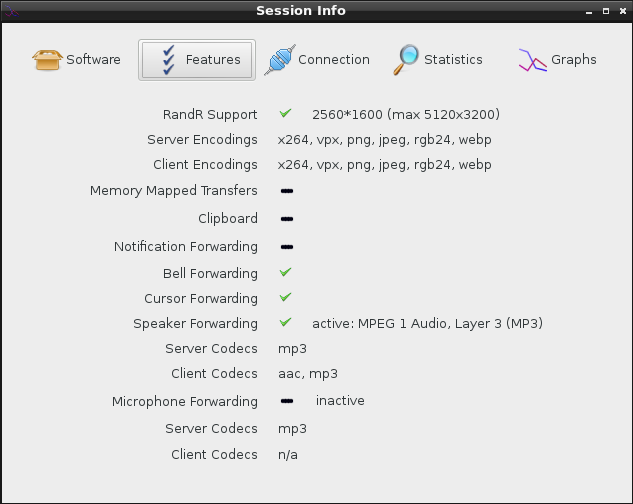
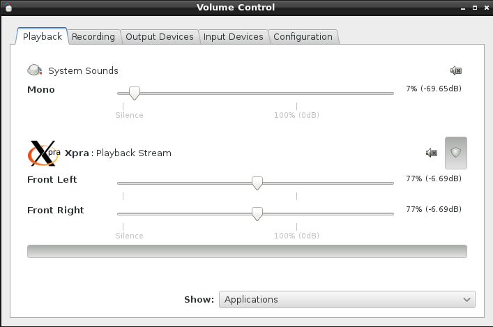
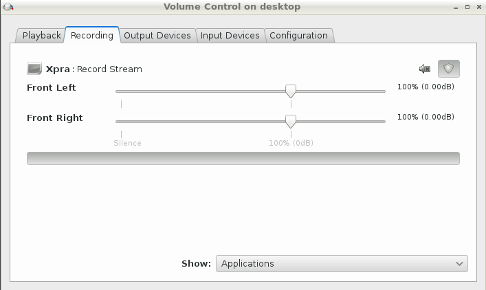

# Audio

Unless you disable audio forwarding, you can start and stop it from the [system tray](System-Tray.md) at any time.

The client and server will negotiate which codec to use. The most widely tested and supported codecs are [opus](http://opus-codec.org/), [vorbis](http://www.vorbis.com/), [flac](https://xiph.org/flac/) and mp3.

Unlike screen updates which are sent as discrete events, audio compression processes the operating system's audio **stream** and so this is a continuous process which will take up a little bit of CPU and bandwidth.

If you want to turn off speaker forwarding, use the option `speaker=off` in your system-wide `xpra.conf` (to disable it globally) or in the per-user [configuration](../Usage/Configuration.md) file, or on the command line

<div class="docs-section-heading" markdown="1">

## Screenshots

</div>
* Audio information displayed on session info (with speaker enabled and running and microphone disabled): \


* A Linux client's pavucontrol showing the Xpra application connected to the local pulseaudio server: \


* pavucontrol running within the xpra session ("on the server"), showing xpra recording the session's audio: \


<div class="docs-section-heading" markdown="1">

## Checking the state of the audio forwarding

</div>

Both ends run the capture and playback pipelines in a
[separate process](../Subsystems/Audio.md), and both report what they are doing.

The `Connection` tab of the client's session info dialog has a `Speaker` and a
`Microphone` row: the label shows the state (`disabled`, `inactive`, `active: opus`, ...)
and the tooltip shows, for the client _and_ the server, the role of the process
(`audio capture` or `audio playback`), its pid, the GStreamer pipeline
and the command line the subprocess was started with.

The same information is available from the command line with `xpra info`:

```
xpra info tcp://localhost:10000 | grep audio
```

The server-wide `audio.*` keys describe what the session supports:

| Key                        | Meaning                                                          |
|----------------------------|------------------------------------------------------------------|
| `audio.initialized`        | whether the GStreamer query has completed                        |
| `audio.speaker.supported`  | whether speaker forwarding can be started at all                 |
| `audio.speaker.codecs`     | the codecs the server is willing to encode to                    |
| `audio.source-plugin`      | the capture plugin (`--audio-source`), `auto` when unspecified   |
| `audio.meter.*`            | the state of the session-wide PulseAudio level meter             |

The per-connection `client.<n>.audio.speaker.*` and `client.<n>.audio.microphone.*` keys
describe the streams that are actually running:

| Key            | Meaning                                                                              |
|----------------|--------------------------------------------------------------------------------------|
| `active`       | `True` only while the stream is being forwarded                                      |
| `state`        | `disabled`, `inactive`, `starting`, `active`, `error`, or `blocked` (audio loop)     |
| `description`  | `audio capture` on the sending side, `audio playback` on the receiving side          |
| `command`      | the command line used to start the capture / playback subprocess                     |
| `pipeline`     | the GStreamer pipeline that subprocess is running                                    |
| `pid`, `codec`, `codec_description`, `bitrate`, `bytes` | stream details                           |

For more verbose output, add `-d audio` to the server (or client) command line.

<div class="docs-section-heading" markdown="1">

## Options

</div>

For low level implementation details, see [audio subsystem](../Subsystems/Audio.md).

<details markdown="1">
  <summary>Main options</summary>

The main controls can be specified in the configuration file or on the command line, and they are documented in the [manual](https://xpra.org/manual.html):
* `speaker=on|off|disabled` / `microphone=on|off|disabled`: audio input and output forwarding control: _on_ will start the forwarding as soon as the connection is established, _off_ will require the user to enable it via the menu, disabled will prevent it from being used and the menu entry will be disabled
* `speaker-codec=CODEC` / `microphone-codec=CODEC`: Specify the codec(s) to use for audio output (speaker) or input (microphone). This parameter can be specified multiple times and the order in which the codecs are specified defines the preferred cod
ec order. Use the special value `help` to get a list of options. When unspecified, all the available codecs are allowed and the first one is used.
* `audio-source=PLUGIN[:OPTIONS]`: Specifies the GStreamer audio plugin used for capturing the audio stream. This affects "speaker forwarding" on the server, and "microphone" forwarding on the client. To get a list of options use the special value _h
elp_. It is also possible to specify plugin options using the form ` "--audio-source=SOURCE:name1=value1,name2=value2,etc"`, ie: `"--audio-source=pulse:device=device.alsa_input.pci-0000_00_14.2.analog-stereo"`
* `audio-sink=SINK[:DEVICE|OPTIONS]`: Specifies the client-side GStreamer audio sink used for speaker playback. The default `auto` selects the platform's default sink. A device can be selected with `--audio-sink=pulsesink:device-name`, or sink attributes can be specified with `--audio-sink=pulsesink:name1=value1,name2=value2`.
</details>

<details markdown="1">
  <summary>Advanced options</summary>

Other options are only available through environment variables for fine-tuning - which should rarely be needed:
* `XPRA_PULSEAUDIO_DEVICE_NAME` to use a specific device if there is more than one device to choose from (can happen when using an existing pulseaudio server with more than one output device attached)
* `XPRA_AUDIO_QUEUE_TIME` can be used to control the default amount of buffering by the receiver
* `XPRA_AUDIO_GRACE_PERIOD` (defaults to `2000`, in milliseconds) errors will be ignored during this grace period after starting audio forwarding, to allow the audio forwarding buffer to settle down
* `XPRA_AUDIO_SINK`: the default sink to use (normally auto-detected)
</details>
