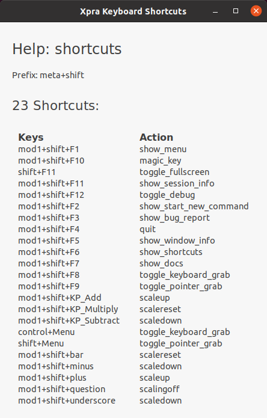

#  Keyboard

Keyboard handling is an area that is constantly seeing improvements and bug fixes.
That's because each platform does things slightly differently and xpra has to somehow convert this data into meaningful keyboard events on the remote end.

## Xpra Keyboard Shortcuts

Xpra utilizes keyboard shortcuts to facilitate quick access to its features.

### How to Find Keyboard Shortcuts in Xpra

- **Via the Tray Icon:** Right-click on the Tray Icon, select `Keyboard`, then `View Shortcuts`.
- **Shortcut Key:** Press `#+F6` directly to bring up the Xpra Keyboard Shortcuts window.

For historical reference, an older list of keyboard shortcuts exists in [#1657](https://github.com/Xpra-org/xpra/issues/1657).

### `#` in Xpra Key Bindings

The `#` symbol represents one or more modifier keys (like `Control` or `Alt+Shift`) in Xpra key bindings.
The exact key `#` stands for varies by platform and can be overriden in configuration.

In the Xpra Keyboard Shortcuts window, the `#` placeholder is named as "Prefix:":

## Common Issues
* When connecting over high latency links, use the `--no-keyboard-sync` option to prevent keys from repeating.
  This toggle is also accessible from the system tray menu. (this switch may cause other problems though)
* US layout and most common layouts should work OK
* If starting xpra from an environment which has non-standard input methods, this can interfere, see [#286](https://github.com/Xpra-org/xpra/issues/286)
* [Input methods](https://tedyin.com/posts/a-brief-intro-to-linux-input-method-framework/) don't work by default: [#634](https://github.com/Xpra-org/xpra/issues/634)
* Supporting multiple layouts and switching layouts reliably and/or manually: [#230](https://github.com/Xpra-org/xpra/issues/230), [#166](https://github.com/Xpra-org/xpra/issues/166), [#86](https://github.com/Xpra-org/xpra/issues/86), [#1607](https://github.com/Xpra-org/xpra/issues/1607), [#1665](https://github.com/Xpra-org/xpra/issues/1665), [#1380](https://github.com/Xpra-org/xpra/issues/1380)
* Multiple keys / meta: [#668](https://github.com/Xpra-org/xpra/issues/668), [#759](https://github.com/Xpra-org/xpra/issues/759)
* Input grabs: [#139](https://github.com/Xpra-org/xpra/issues/139)

## Reporting Bugs
First, please check for existing issues that may match your problem.
Failing that, make sure to read the [reporting bugs](https://github.com/Xpra-org/xpra/wiki/Reporting-Bugs) guidelines,
and generally you will need to include (only those that apply):
* try the keyboard debugging tool found in the `xpra toolbox`
* active keyboard layout(s)
* input methods
* keyboard related configuration setup/files
* keyboard type
* client and server [log output](../Usage/Logging.md) with the `-d keyboard` debugging switch
* whether the bug is also present with / without the `--no-keyboard-sync` switch
* X11 systems:
** `setxkbmap -print` and `setxkbmap -query` (both directly in the client if it supports those commands and in the xpra session)
** `xmodmap -pke` and `xmodmap -pm` (again on both)
** `xkbprint -label name $DISPLAY`
* MS Windows: `Keymap_info.exe`
* if the problem is affecting specific keys, you may want to use the environment variable `XPRA_DEBUG_KEYSYMS=keyname1,keyname2` on the server to log the keyboard mapping process for those keys
* X11 servers: `xev` output of the misbehaving key events
