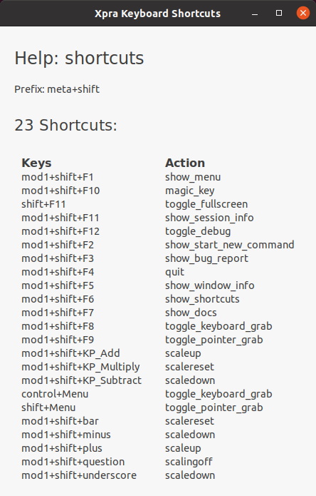

# Keyboard

Keyboard handling is an area that is constantly seeing improvements and bug fixes.
That's because each platform does things slightly differently and xpra has to somehow convert this data into meaningful keyboard events on the remote end.

<div class="docs-section-heading" markdown="1">

## Xpra Keyboard Shortcuts

</div>

Xpra utilizes keyboard shortcuts to facilitate quick access to its features.

### How to Find Keyboard Shortcuts in Xpra

- **Via the Tray Icon:** Right-click on the Tray Icon, select `Keyboard`, then `View Shortcuts`.
- **Shortcut Key:** Press `#+F6` directly to bring up the Xpra Keyboard Shortcuts window.

For historical reference, an older list of keyboard shortcuts exists in [#1657](https://github.com/Xpra-org/xpra/issues/1657).

### `#` in Xpra Key Bindings

The `#` symbol represents one or more modifier keys (like `Control` or `Alt+Shift`) in Xpra key bindings.
The exact key `#` stands for varies by platform and can be overriden in configuration.

In the Xpra Keyboard Shortcuts window, the `#` placeholder is named as "Prefix:":



<div class="docs-section-heading" markdown="1">

## Common Issues

</div>
* When connecting over high latency links, use the `--no-keyboard-sync` option to prevent keys from repeating.
  This toggle is also accessible from the system tray menu. (this switch may cause other problems though)
* US layout and most common layouts should work OK
* If starting xpra from an environment which has non-standard input methods, this can interfere, see [#286](https://github.com/Xpra-org/xpra/issues/286)
* [Input methods](https://tedyin.com/posts/a-brief-intro-to-linux-input-method-framework/) don't work by default: [#634](https://github.com/Xpra-org/xpra/issues/634)
* Supporting multiple layouts and switching layouts reliably and/or manually: [#230](https://github.com/Xpra-org/xpra/issues/230), [#166](https://github.com/Xpra-org/xpra/issues/166), [#86](https://github.com/Xpra-org/xpra/issues/86), [#1607](https://github.com/Xpra-org/xpra/issues/1607), [#1665](https://github.com/Xpra-org/xpra/issues/1665), [#1380](https://github.com/Xpra-org/xpra/issues/1380)
* Multiple keys / meta: [#668](https://github.com/Xpra-org/xpra/issues/668), [#759](https://github.com/Xpra-org/xpra/issues/759)
* Input grabs: [#139](https://github.com/Xpra-org/xpra/issues/139)


<div class="docs-section-heading" markdown="1">

## Debugging

</div>

Keyboard events are interpreted on the client and mapped again on the server,
so diagnostics from both ends are often needed.

### Xpra diagnostics

The **Keyboard** event viewer in `xpra toolbox` shows the detected model,
layout, variant and options, then reports layout changes, modifiers, keycodes,
keysyms and XKB groups in real time. It can also be opened directly:

```shell
xpra example view-keyboard
```

To print the detected keyboard configuration and, on X11, the complete keysym
map, use:

```shell
xpra keyboard -v
```

Enable keyboard debug logging on the client and server with `-d keyboard`:

```shell
xpra attach :DISPLAY -d keyboard
xpra seamless :DISPLAY -d keyboard --start=xterm
```

For an already-running session, logging can be enabled at runtime on the server
and on its connected clients:

```shell
xpra control :DISPLAY debug enable keyboard
xpra control :DISPLAY client debug enable keyboard
```

See [Logging](../Usage/Logging.md) for log locations and more ways to control
debug categories.

To capture the keymap that a client would send and test whether an X11 server
can generate all of its keys, use:

```shell
xpra keymap keymap.json
xpra keymap-test keymap.json
```

`keymap-test` uses a temporary X11 display by default. Passing an explicit
display tests that display but modifies its keymap for the duration of the test.
Individual keysyms can be checked by adding their names to the command, for
example `xpra keymap-test keymap.json Alt_R ISO_Level3_Shift`.

For detailed server-side mapping logs concerning only specific keysyms, set
`XPRA_DEBUG_KEYSYMS` before starting the server and enable keyboard logging:

```shell
XPRA_DEBUG_KEYSYMS=Alt_R,ISO_Level3_Shift \
  xpra seamless :DISPLAY -d keyboard --start=xterm
```

### X11 tools

These utilities help identify which layer is producing an incorrect result:

* [xkeycaps](https://man.archlinux.org/man/xkeycaps.1x.en)
  displays the current X11 keyboard mapping graphically and highlights key
  activity.
* [xkbwatch](https://www.x.org/archive/X11R7.5/doc/man/man1/xkbwatch.1.html)
  displays real-time XKB modifier, lock, latch and active group state. The
  active group distinguishes layouts such as `us` and `de`.
* [Screenkey](https://gitlab.com/screenkey/screenkey) displays interpreted
  keystrokes as an on-screen overlay.
* [xkbprint](https://man.archlinux.org/man/xkbprint.1.en) creates a static,
  layout-aware drawing of the current XKB keyboard description:

  ```shell
  xkbprint -label name "$DISPLAY" keyboard.ps
  ```

* [xev](https://man.archlinux.org/man/xev.1.en) reports
  keycodes, keysyms and modifier state for events delivered to its window.

Compare the output from
[setxkbmap](https://man.archlinux.org/man/setxkbmap.1.html) and
[xmodmap](https://man.archlinux.org/man/xmodmap.1.en) on the client desktop and
inside the Xpra session:

```shell
setxkbmap -print
setxkbmap -query
xmodmap -pke
xmodmap -pm
```

This comparison shows whether the discrepancy originates in the client keymap,
the keymap installed in the session, or Xpra's event translation.

<div class="docs-section-heading" markdown="1">

## Reporting Bugs

</div>
First, please check for existing issues that may match your problem.
Failing that, make sure to read the [reporting bugs](https://github.com/Xpra-org/xpra/wiki/Reporting-Bugs) guidelines,
and generally you will need to include (only those that apply):

* results from the relevant diagnostics above
* active keyboard layout(s)
* input methods
* keyboard related configuration setup/files
* keyboard type
* client and server [log output](../Usage/Logging.md) with the `-d keyboard` debugging switch
* whether the bug is also present with / without the `--no-keyboard-sync` switch
* X11 systems:
  * `setxkbmap -print` and `setxkbmap -query` (both directly in the client if it supports those commands and in the Xpra session)
  * `xmodmap -pke` and `xmodmap -pm` (again on both)
  * `xkbprint -label name $DISPLAY`
* MS Windows: `Keymap_info.exe`
* if the problem is affecting specific keys, you may want to use the environment variable `XPRA_DEBUG_KEYSYMS=keyname1,keyname2` on the server to log the keyboard mapping process for those keys
* X11 servers: `xev` output of the misbehaving key events
