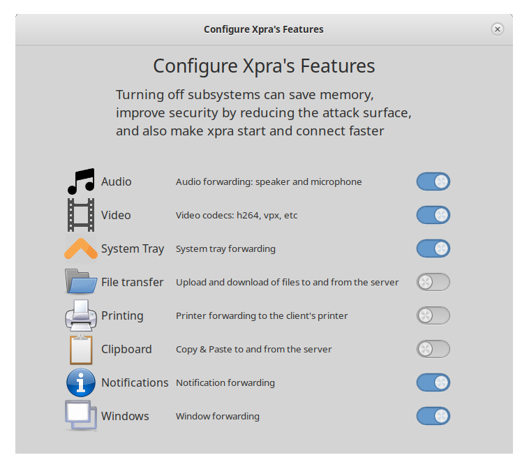

# Features

Xpra integrates remote applications with your local desktop by forwarding
windows, devices, and data while adapting display output to each client.

<section class="docs-card docs-screenshot-card docs-card-wide" markdown="1">

### Configure features graphically

Features can be configured using the GUI. Open **Xpra**, choose **Configure**,
then select **Features** to turn individual subsystems on or off. See the
[usage guide](../Usage/README.md) for the other graphical tools and command-line
examples.

</section>

## Feature guides

Choose a category to learn how each forwarded feature works and how to
configure it.

<section class="docs-card" markdown="1">

### Device forwarding

- [Audio](Audio.md) — speakers and microphones
- [Printers](Printing.md)
- [Webcams](Webcam.md)
- [Keyboard](Keyboard.md)

</section>

<section class="docs-card" markdown="1">

### Data synchronization

- [Clipboard](Clipboard.md)
- [File transfers](File-Transfers.md)
- [System tray](System-Tray.md)
- [Notifications](Notifications.md)

</section>

<section class="docs-card docs-card-wide" markdown="1">

### [Display characteristics](Display.md)

- [Image depth](Image-Depth.md)
- [Colourspace](Colourspace.md)
- [DPI](DPI.md)

</section>

## Related documentation

Explore session types, connectivity, security, performance, and deployment.

<section class="docs-card" markdown="1">

### Sessions and clients

- [Seamless](../Usage/Seamless.md) and [desktop](../Usage/Desktop.md) modes
- [Shadow](../Usage/Shadow.md) existing displays
- [HTML5 client](https://github.com/Xpra-org/xpra-html5)
- Session sharing
- [Platform support](https://github.com/Xpra-org/xpra/wiki/Platforms)

</section>

<section class="docs-card" markdown="1">

### Networking and security

- Types of [network connections](../Network/README.md)
- [Authentication](../Usage/Authentication.md)
- [Encryption](../Network/Encryption.md) with [AES](../Network/AES.md) or
  [SSL](../Network/SSL.md)
- Session discovery via [mDNS](../Network/Multicast-DNS.md)
- Shared memory and vsock connections

</section>

<section class="docs-card" markdown="1">

### Performance and graphics

- Automatic [picture encoding](../Usage/Encodings.md)
- Hardware acceleration
- [OpenGL accelerated rendering](../Usage/Client-OpenGL.md)

</section>

<section class="docs-card" markdown="1">

### Deployment

- [Proxy server](../Usage/Proxy-Server.md) connection multiplexing
- Running as a [system service](../Usage/Service.md)

</section>

