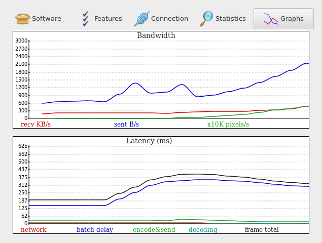

#  Network

See also: [protocol](Protocol.md), [authentication](../Usage/Authentication.md), [encryption](Encryption.md) and [multicast DNS](Multicast-DNS.md)

## Connection Types
| Type                 | Bind option  | Availability                                                                 | Information                                                                                         |
|----------------------|--------------|------------------------------------------------------------------------------|-----------------------------------------------------------------------------------------------------|
| `TCP`                | `bind-tcp`   | All                                                                          |
| [QUIC](QUIC.md)      | `bind-quic`  | All                                                                          |
| [SSL](SSL.md)        | `bind-ssl`   | All                                                                          |
| [SSH](SSH.md)        | `bind-ssh`   | All                                                                          |
| `WebSocket`          | `bind-ws`    | All                                                                          |
| `Secure WebSocket`   | `bind-wss`   | All                                                                          |
| `RFB`                | `bind-rfb`   | [desktop](../Usage/Desktop.md) and [shadow](../Usage/Shadow.md) servers only | Allows VNC clients to connect                                                                       |
| `unix domain socket` | `bind`       | Posix                                                                        | Local connections or via [SSH](SSH.md)                                                              |
| `named-pipe`         | `bind`       | MS Windows                                                                   | [#1150](https://github.com/Xpra-org/xpra/issues/1150)                                               |
| `vsock`              | `bind-vsock` | Linux                                                                        | host - guest virtual machines connections - see [#983](https://github.com/Xpra-org/xpra/issues/983) |

`TCP` sockets can also be upgraded transparently to (`Secure`) `WebSocket`, `SSL`, `SSH` and `RFB`, so a single `TCP` port can support 6 different protocols automatically.\
Unencrypted modes like plain-`TCP` and plain-`WebSocket` can also be secured with [AES](AES.md).\
All the sockets that can be accessed via a network connection (all but `vsock` and `named-pipe`) will usually be published via [multicast DNS](Multicast-DNS.md). On Posix, `unix-domain-sockets` are exposed as `SSH` as we assume that a local SSH server is always available.

By default, local unix domain sockets (`--bind=auto` which is the default) also create [`abstract sockets`](https://github.com/Xpra-org/xpra/issues/4098), use `--bind=noabstract` if needed.

See also: [Security Considerations](../Usage/Security.md)

## Examples:
<details>
  <summary>TCP Upgrade to WebSocket</summary>

```shell
xpra seamless --start=xterm --bind-tcp=0.0.0.0:10000
```
```shell
xpra attach ws://localhost:10000/
```
The same address (10000 here) can also be opened in a browser to use the HTML5 client:
```shell
xdg-open http://localhost:10000/
```
</details>

<details>
  <summary>SSH with password file</summary>

```shell
echo -n thepassword > password.txt
xpra seamless --start=xterm --bind-ssh=0.0.0.0:10000,auth=file,filename=password.txt
```
```shell
xpra attach ssh://localhost:10000/
```
The client will prompt for the password, as found in the `password.txt` file and not the regular shell account password.
</details>

***

## Network Performance
Xpra will try to detect your network adapter and connection characteristics,
and it should adapt to changing network capacity and performance.
However, it may not always get it right,
and you may need to turn off bandwidth detection (`bandwidth-detection` option) and / or
specify your own bandwidth constraints. (`bandwidth-limit` option).

---

The performance of each session will be affected by the network link speed, in particular [bufferbloat](https://en.wikipedia.org/wiki/Bufferbloat) is known to cause severe performance degradations as xpra is quite sensitive to network jitter and latency, try to [eliminate bufferbloat in your network](https://www.bufferbloat.net/projects/bloat/wiki/What_can_I_do_about_Bufferbloat/).
[This is now a solvable problem](https://cacm.acm.org/practice/you-dont-know-jack-about-bandwidth/)
See [A little bump in the wire that makes your Internet faster](https://apenwarr.ca/log/?m=201808), [bufferbloat faq](https://gettys.wordpress.com/bufferbloat-faq/).

QUIC should offer the lowest latency, though it may need [some tuning](https://github.com/Xpra-org/xpra/issues/3376).

For Linux systems, [Queueing in the Linux Network Stack](http://www.coverfire.com/articles/queueing-in-the-linux-network-stack/) is recommended reading for a deeper understanding.

---

You can see how much bandwidth is used and how good the picture latency is using the "Graphs" tab of the "Session Info" dialog found in Xpra's own menu:



More network information is available elsewhere in the "Session Info" dialog or via the "xpra info" command.


## Diagnostics

### General
Tunnels and VPNs can and often do mangle traffic, causing extra latency and
generally making it more difficult to identify issues.  
When investigating connection or latency issues, prefer direct connections that bypass any proxy, VPN, firewall, tunnel, etc
Then only re-add these potential bottlenecks if the direct connection exhibits the same behaviour.  
Also prefer plain TCP connections over their WebSocket / SSL / QUIC counterparts - comparing different connection types can also provide useful data points.  
Always ensure that there are no major warnings in the server log or client output, these may already point to the root cause (ie: GPU contention, encoding or decoding errors, etc).


### Tools and Samples

Running `xpra info | grep latency` does capture some important measurements, these differ from network testing tools like `ping`
because the samples are captured from the application itself, as it is experienced by the software,
and after traversing all the operating system and library layers that sit between the wire and the software.  
Comparing these values with the more crude values obtained from `ping`, `tcpping` or `nmap` can already expose significant sources of latency because the application is much more sensitive to system load and memory bandwidth than raw wire data.

`xpra info` is normally used against a server when no address is specified,
but it can also be used to collect data directly from a client process.
The client does send some of this data to the server, but more of it is accessible by connecting directly to the client.


### Definitions

From the output of `xpra info`:
* `connection.client.ping_latency` this is the application ping latency as experienced by the client when it pings the server
* `connection.server.ping_latency` this is the application ping latency as experienced by the server when it pings the client
* `damage.frame-total-latency` the average total time it takes for a screen update to be displayed on the client (to the backbuffer only - not including vblank or any compositor buffering)
* `damage.client-latency` the average frame time without decoding or displaying it
* `damage.in_latency` the average delay between receiving screen update notifications from an application and actually processing them

As for the suffixes:
* `avg`: average
* `cur`: current
* `min`: minimum value seen
* `max`: maximum value seen
*  `90p`: 90 percentile


### Common Issues

* latency swings are more damaging than more stable high latency values - the xpra engine will try to adjust, but this may take time and things can quickly get worse before it does
* packet loss (ie: wifi connections) can have a dramatic effect on all types of connection except QUIC, this is not directly exposed to the application which makes it hard to adapt
* some applications have problematic behaviour that may require more fine-tuning: screen update storms, unnecessarily high refresh rate, unused alpha channel, etc
* if the `ping_latency` is much higher on the server, this usually indicates an overloaded server


### Caveats

* quantum state: collecting data with `xpra info` does interfere somewhat with the process being queried, as it creates some extra contention for resources, which can affect the behaviour of the application or the data collected or both
* try to capture the data when the problem occurs, not before or after - this may require using scripting or a second pair of hands
* generally, there are few telltale values - only problematic combinations or changes
