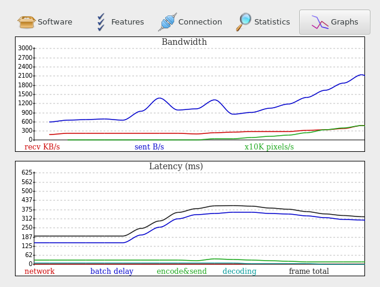

# Networking

Xpra can connect through local sockets or a range of network transports. Start
with SSH for a straightforward encrypted connection, or choose another
transport when you need browser access, lower latency, or compatibility with
other remote-desktop clients.

<div class="docs-section-heading" markdown="1">

## Choose a connection type

The bind option creates a server endpoint. Clients connect using the matching
URL scheme, such as `ssh://`, `ssl://`, or `quic://`.

</div>

<div class="docs-grid" markdown="1">
<section class="docs-card" markdown="1">

### [SSH](SSH.md)

Use `--bind-ssh` on any platform. SSH provides host verification,
authentication, and encryption, and is the usual choice for connecting across
a network.

Local Unix domain sockets can also be reached through an existing SSH server.

</section>

<section class="docs-card" markdown="1">

### [TLS](SSL.md), [QUIC](QUIC.md), and secure WebSocket

These encrypted transports are available on all platforms:

- `--bind-ssl` creates a TLS endpoint
- `--bind-quic` creates a QUIC endpoint
- `--bind-wss` creates a secure WebSocket endpoint

QUIC should offer the lowest latency and handles packet loss well, though it
may need [some tuning](https://github.com/Xpra-org/xpra/issues/3376).

</section>

<section class="docs-card" markdown="1">

### TCP and WebSocket

Use `--bind-tcp` or `--bind-ws` on any platform. Plain TCP and WebSocket
connections are not encrypted; protect them with [AES](AES.md), place them
behind a secure proxy, or use an encrypted transport instead.

A TCP endpoint can also serve the HTML5 client and automatically recognize
WebSocket connections.

</section>

<section class="docs-card" markdown="1">

### Local and virtual-machine connections

- `--bind` creates Unix domain sockets on POSIX systems
- `--bind` creates a
  [named pipe](https://github.com/Xpra-org/xpra/issues/1150) on Windows
- `--bind-vsock` connects Linux hosts and guest virtual machines; see
  [#983](https://github.com/Xpra-org/xpra/issues/983)

The default `--bind=auto` also creates
[abstract sockets](https://github.com/Xpra-org/xpra/issues/4098) on supported
systems. Use `--bind=noabstract` to disable them.

</section>

<section class="docs-card docs-card-wide" markdown="1">

### [RFB / VNC](RFB.md) and RDP compatibility

`--bind-rfb` allows VNC clients to connect to
[desktop](../Usage/Desktop.md), `monitor`, and [shadow](../Usage/Shadow.md)
servers. Xpra can also connect to a VNC server using a `vnc://` URL.

`--bind-rdp` is available for the same server types, but only the connection
handshake is implemented so far; follow [#4476](https://github.com/Xpra-org/xpra/issues/4476)
for progress.

</section>
</div>
<div class="docs-section-heading" markdown="1">

## How endpoints behave

One listening port can support several clients and protocols.

</div>

<div class="docs-grid" markdown="1">
<section class="docs-card" markdown="1">

### Automatic protocol upgrades

A TCP socket can recognize and upgrade WebSocket, secure WebSocket, TLS, SSH,
RFB, and RDP connections. Including plain TCP, one port can therefore support
seven protocols automatically.

This makes it possible to serve native Xpra clients, compatible remote-desktop
clients, and the HTML5 client from the same address. See the
[protocol reference](Protocol.md) for details of Xpra's application-level
messages.

</section>

<section class="docs-card" markdown="1">

### Discovery and security

Network-accessible sockets are normally published through
[multicast DNS](Multicast-DNS.md). This excludes `vsock` and Windows named
pipes; POSIX Unix domain sockets are advertised as SSH connections when a local
SSH server is available.

Before exposing an endpoint, configure [authentication](../Usage/Authentication.md),
[encryption](Encryption.md), and review the [security guidance](../Usage/Security.md).

</section>
</div>

<div class="docs-section-heading" markdown="1">

## Connection examples

The examples below expose port `10000`. Check the firewall and security policy
on the server before making a port reachable from other machines.

</div>

<div class="docs-grid" markdown="1">
<section class="docs-card" markdown="1">

### TCP upgraded to WebSocket

Start a seamless session with a TCP listener:

```shell
xpra seamless --start=xterm --bind-tcp=0.0.0.0:10000
```

Connect using WebSocket:

```shell
xpra attach ws://localhost:10000/
```

Open the same address in a browser to use the HTML5 client:

```shell
xdg-open http://localhost:10000/
```

</section>

<section class="docs-card" markdown="1">

### SSH with a password file

Create the password file and start an SSH listener with file authentication:

```shell
echo -n thepassword > password.txt
xpra seamless --start=xterm \
    --bind-ssh=0.0.0.0:10000,auth=file(filename=password.txt)
```

Then attach to it:

```shell
xpra attach ssh://localhost:10000/
```

The client prompts for the password stored in `password.txt`, not the regular
shell account password.

</section>
</div>

<div class="docs-section-heading" markdown="1">

## Network performance

Xpra adapts picture delivery to the connection, but network configuration and
queueing still have a large effect on responsiveness.

</div>

<div class="docs-grid" markdown="1">
<section class="docs-card" markdown="1">

### Bandwidth adaptation

Xpra tries to detect the network adapter and connection characteristics, and
adapts when capacity changes. If detection is inaccurate, disable
`bandwidth-detection` and set an explicit `bandwidth-limit`.

</section>

<section class="docs-card" markdown="1">

### Latency and queueing

[Bufferbloat](https://en.wikipedia.org/wiki/Bufferbloat) can cause severe
performance degradation because Xpra is sensitive to jitter and latency. The
[Bufferbloat project](https://www.bufferbloat.net/projects/bloat/wiki/What_can_I_do_about_Bufferbloat/)
explains practical ways to reduce it.

For background, see
[You Don't Know Jack About Bandwidth](https://cacm.acm.org/practice/you-dont-know-jack-about-bandwidth/),
[A little bump in the wire that makes your Internet faster](https://apenwarr.ca/log/?m=201808),
the [bufferbloat FAQ](https://gettys.wordpress.com/bufferbloat-faq/), and
[Queueing in the Linux Network Stack](http://www.coverfire.com/articles/queueing-in-the-linux-network-stack/).

</section>

<section class="docs-card docs-screenshot-card docs-card-wide" markdown="1">

### Monitor a live session

<a class="docs-screenshot-link" href="../images/session-info-graphs.png">

</a>

The **Graphs** tab in the **Session Info** dialog shows bandwidth use and
picture latency. More network measurements are available elsewhere in that
dialog and from the `xpra info` command.

</section>
</div>

<div class="docs-section-heading" markdown="1">

## Diagnose network problems

Measure the connection as the application experiences it, then compare that
with simpler network tests to locate latency outside Xpra.

</div>

<div class="docs-grid" markdown="1">
<section class="docs-card docs-card-wide" markdown="1">

### Establish a direct baseline

Tunnels, VPNs, proxies, and firewalls can add latency or alter traffic. Test a
direct connection first, then reintroduce each layer. Prefer plain TCP while
diagnosing because comparing it with WebSocket, TLS, or QUIC helps isolate the
transport layer.

Check the client output and server log for warnings before focusing on the
network. GPU contention and encoding or decoding errors can look like network
problems.

</section>

<section class="docs-card" markdown="1">

### Collect application-level samples

```shell
xpra info | grep latency
```

These samples include the operating-system and library layers between the wire
and Xpra. Compare them with `ping`, `tcpping`, or `nmap`: a large difference
can reveal system load or memory-bandwidth bottlenecks that raw network tests
do not show.

With no address, `xpra info` queries a server. It can also query a client
process directly, where additional client-side measurements are available.

</section>

<section class="docs-card" markdown="1">

### Interpret the measurements

- `connection.client.ping_latency` — client-to-server application ping latency
- `connection.server.ping_latency` — server-to-client application ping latency
- `damage.frame-total-latency` — average time until an update reaches the
  client backbuffer, excluding vblank and compositor buffering
- `damage.client-latency` — average frame time without decoding or display
- `damage.in_latency` — average delay before a screen update is processed

Suffixes describe the sample: `avg`, `cur`, `min`, `max`, and `90p` for the
90th percentile.

</section>

<section class="docs-card" markdown="1">

### Common warning signs

- Latency swings are often more disruptive than stable high latency because
  adaptation takes time.
- Packet loss, particularly over Wi-Fi, can strongly affect every transport
  except QUIC and is not directly exposed to the application.
- Screen-update storms, high refresh rates, or unused alpha channels can make
  particular applications require more tuning.
- Much higher server-side `ping_latency` often indicates an overloaded server.

</section>

<section class="docs-card" markdown="1">

### Measurement caveats

Querying a process with `xpra info` creates some extra resource contention and
can affect the application or the measurements. Capture data while the problem
is happening—this may require automation or a second person—and focus on
combinations and changes rather than treating one value as conclusive.

</section>
</div>
