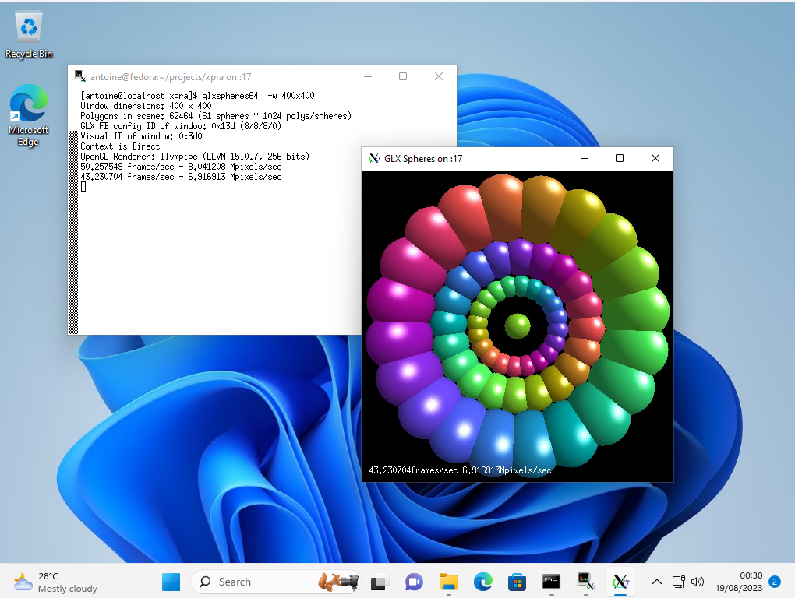

Persistent remote applications and desktops

Xpra lets you run applications on a remote machine, display them locally,
and disconnect and reconnect without losing their state.

[Get started](Usage/README.md)
[Install Xpra](https://github.com/Xpra-org/xpra/wiki/Download)
[Read the FAQ](FAQ.md)

These pages document the current development version of Xpra.

## Browse the documentation

Start with a common task or explore a topic in more depth.

<section class="docs-card" markdown="1">

### [Start using Xpra](Usage/README.md)

Launch individual applications, a full desktop, or view an existing display.

- [Seamless applications](Usage/Seamless.md)
- [Desktop sessions](Usage/Desktop.md)
- [Shadow an existing display](Usage/Shadow.md)

Configuration and advanced topics

- [Configuration options](Usage/Configuration.md)
- [Authentication modules](Usage/Authentication.md)
- [Proxy server](Usage/Proxy-Server.md)
- [System service](Usage/Service.md)
- [Picture encodings](Usage/Encodings.md)
- [Server OpenGL](Usage/OpenGL.md) and [client OpenGL](Usage/Client-OpenGL.md)
- [Client implementations](Usage/Clients.md)
- [Xdummy](Usage/Xdummy.md)

</section>

<section class="docs-card" markdown="1">

### [Desktop integration](Features/README.md)

Forward devices and make remote applications feel at home on the local desktop.

- [Audio](Features/Audio.md)
- [Clipboard](Features/Clipboard.md)
- [File transfers](Features/File-Transfers.md)
- [Printers](Features/Printing.md)

More integrations

- [Webcams](Features/Webcam.md)
- [Keyboard](Features/Keyboard.md)
- [System tray](Features/System-Tray.md)
- [Notifications](Features/Notifications.md)
- [Image depth](Features/Image-Depth.md)
- [Colourspace](Features/Colourspace.md)
- [DPI](Features/DPI.md)

</section>

<section class="docs-card" markdown="1">

### [Networking and security](Network/README.md)

Choose a connection method and secure access to Xpra sessions.

- [SSH](Network/SSH.md)
- [SSL / TLS](Network/SSL.md)
- [QUIC](Network/QUIC.md)
- [Encryption](Network/Encryption.md)
- [Authentication](Usage/Authentication.md)

More network topics

- [Multicast DNS discovery](Network/Multicast-DNS.md)
- [AES](Network/AES.md)
- [RFB](Network/RFB.md)

</section>

<section class="docs-card" markdown="1">

### Technical reference

Details for developers, integrators, and anyone investigating Xpra internals.

- [Network protocol](Network/Protocol.md)
- [Subsystems](Subsystems/README.md)
- [Security guidance](Usage/Security.md)
- [Client implementations](Usage/Clients.md)
- [Encoding options](Usage/Encodings.md)

</section>

<section class="docs-card" markdown="1">

### [Build Xpra](Build/README.md)

Build from source or prepare packages for a supported platform.

- [Dependencies](Build/Dependencies.md)
- [Fedora and Red Hat](Build/RPM.md)
- [Debian and Ubuntu](Build/Debian.md)
- [Microsoft Windows](Build/MSWindows.md)
- [macOS](Build/MacOS.md)
- [Other platforms](Build/Other.md)

</section>

<section class="docs-card" markdown="1">

### Project and support

Find downloads, answers, source code, and ways to support the project.

- [Download Xpra](https://github.com/Xpra-org/xpra/wiki/Download)
- [Frequently asked questions](FAQ.md)
- [GitHub repository](https://github.com/Xpra-org/xpra)
- [Community discussions](https://github.com/orgs/Xpra-org/discussions)
- [Sponsors](SPONSORS.md)

</section>

