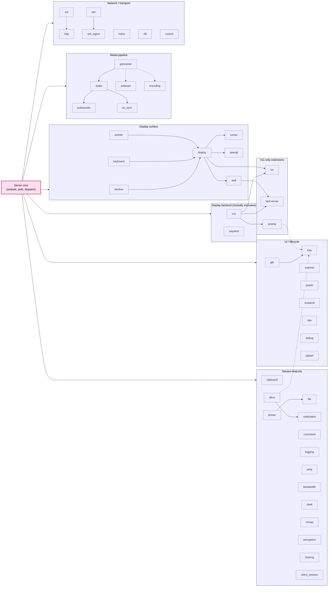

# Subsystems

This documentation refers to individual [protocol](../Network/Protocol.md) features,
it links to the implementation and technical documentation for each subsystem.

Each subsystem should be using its own prefix for capabilities and packet types. (most already do)

Most modules are optional, see [security considerations](../Usage/Security.md).

See the [display server data inventory](Display-Server-Data.md) for the
non-framebuffer data that can be retrieved from display servers and associated
desktop-session services.

## Concepts

* Client Module: feature implementation loaded by the client, it interfaces with the corresponding "Client Connection Module" on the server side
* Client Connection Module: for each connection with a client, the server will instantiate a handler
* Server Module: feature implemented by the server, it may interact with multiple "Client Connection Modules"

A client or server may choose to completely disable a subsystem.\
When this is the case, it will not load the module into memory and will not know how to handle requests for this feature.

Most subsystems are independent of each other. The diagram below shows the dependencies enforced at subsystem load time (see [`xpra/server/features.py`](https://github.com/Xpra-org/xpra/blob/master/xpra/server/features.py)).
Solid arrows mark a *hard* requirement &mdash; the dependent subsystem cannot be enabled unless its parent is also enabled.
Dashed arrows mark *soft* or alternative dependencies &mdash; the subsystem can use the parent if it is available, or has an alternative code path on some platforms.

Notes:
* `display` is auto-enabled when any of `window`, `keyboard` or `pointer` is enabled &mdash; it is the union of those features rather than a prerequisite.
* `notification` requires `dbus` on Linux, but has native code paths on Windows and macOS (shown as dashed via `DBus`).
* `tray` requires `gtk` and (for the system tray icon on X11) the `systray` extension.
* The `ICC`, `bell server` and `systray` subsystems are loaded only on X11 sessions, and require both `x11` and the corresponding feature flag.
* `pulseaudio` and `av_sync` are strict refinements of `audio`, which itself requires `gstreamer`.

## Protocol Subsystems

These subsystems involve communication between client and server.

| Subsystem                       | [Client Module](https://github.com/Xpra-org/xpra/blob/master/xpra/client/subsystem/)               | [Server Module](https://github.com/Xpra-org/xpra/blob/master/xpra/server/subsystem)                | [Client Connection Module](https://github.com/Xpra-org/xpra/blob/master/xpra/server/source/) | User Documentation                                    |
|---------------------------------|----------------------------------------------------------------------------------------------------|-----------------------------------------------------------------------------------------------------|----------------------------------------------------------------------------------------------|-------------------------------------------------------|
| [Audio](Audio.md)               | [audio](https://github.com/Xpra-org/xpra/blob/master/xpra/client/subsystem/audio.py)               | [audio](https://github.com/Xpra-org/xpra/blob/master/xpra/server/subsystem/audio.py)               | [audio](https://github.com/Xpra-org/xpra/blob/master/xpra/server/source/audio.py)           | [audio feature](../Features/Audio.md)                 |
| [Bandwidth](Bandwidth.md)       | [bandwidth](https://github.com/Xpra-org/xpra/blob/master/xpra/client/subsystem/bandwidth.py)       | [bandwidth](https://github.com/Xpra-org/xpra/blob/master/xpra/server/subsystem/bandwidth.py)       | [bandwidth](https://github.com/Xpra-org/xpra/blob/master/xpra/server/source/bandwidth.py)   | n/a                                                   |
| [Clipboard](Clipboard.md)       | [clipboard](https://github.com/Xpra-org/xpra/blob/master/xpra/client/subsystem/clipboard.py)       | [clipboard](https://github.com/Xpra-org/xpra/blob/master/xpra/server/subsystem/clipboard.py)       | [clipboard](https://github.com/Xpra-org/xpra/blob/master/xpra/server/source/clipboard.py)   | [clipboard feature](../Features/Clipboard.md)         |
| [Command](Command.md)           | [command](https://github.com/Xpra-org/xpra/blob/master/xpra/client/subsystem/command.py)           | [command](https://github.com/Xpra-org/xpra/blob/master/xpra/server/subsystem/command.py)           | none                                                                                         | n/a                                                   |
| [Cursor](Cursor.md)             | [cursor](https://github.com/Xpra-org/xpra/blob/master/xpra/client/subsystem/cursor.py)             | [cursor](https://github.com/Xpra-org/xpra/blob/master/xpra/server/subsystem/cursor.py)             | [cursor](https://github.com/Xpra-org/xpra/blob/master/xpra/server/source/cursor.py)         | n/a                                                   |
| [Display](Display.md)           | [display](https://github.com/Xpra-org/xpra/blob/master/xpra/client/subsystem/display.py)           | [display](https://github.com/Xpra-org/xpra/blob/master/xpra/server/subsystem/display.py)           | [display](https://github.com/Xpra-org/xpra/blob/master/xpra/server/source/display.py)       | Automatically configured                              |
| [Encoding](Encoding.md)         | [encoding](https://github.com/Xpra-org/xpra/blob/master/xpra/client/subsystem/encoding.py)         | [encoding](https://github.com/Xpra-org/xpra/blob/master/xpra/server/subsystem/encoding.py)         | [encoding](https://github.com/Xpra-org/xpra/blob/master/xpra/server/source/encoding.py)     | Automatically configured                              |
| [Encryption](n/a)               | n/a                                                                                                 | [encryption](https://github.com/Xpra-org/xpra/blob/master/xpra/server/subsystem/encryption.py)     | n/a                                                                                          | [encryption](../Network/Encryption.md)                |
| [File](n/a)                     | n/a                                                                                                 | [file](https://github.com/Xpra-org/xpra/blob/master/xpra/server/subsystem/file.py)                 | [file](https://github.com/Xpra-org/xpra/blob/master/xpra/server/source/file.py)             | [file transfers](../Features/File-Transfers.md)       |
| [Info](Info.md)                 | [server_info](https://github.com/Xpra-org/xpra/blob/master/xpra/client/subsystem/server_info.py)   | [info](https://github.com/Xpra-org/xpra/blob/master/xpra/server/subsystem/info.py)                 | n/a                                                                                          |                                                       |
| [Keyboard](Keyboard.md)         | [keyboard](https://github.com/Xpra-org/xpra/blob/master/xpra/client/subsystem/keyboard.py)         | [keyboard](https://github.com/Xpra-org/xpra/blob/master/xpra/server/subsystem/keyboard.py)         | [keyboard](https://github.com/Xpra-org/xpra/blob/master/xpra/server/source/keyboard.py)     | [keyboard feature](../Features/Keyboard.md)           |
| [Logging](Logging.md)           | [logging](https://github.com/Xpra-org/xpra/blob/master/xpra/client/subsystem/logging.py)           | [logging](https://github.com/Xpra-org/xpra/blob/master/xpra/server/subsystem/logging.py)           | none                                                                                         | [logging usage](../Usage/Logging.md)                  |
| [Menu](n/a)                     | n/a                                                                                                 | [menu](https://github.com/Xpra-org/xpra/blob/master/xpra/server/subsystem/menu.py)                 | [menu](https://github.com/Xpra-org/xpra/blob/master/xpra/server/source/menu.py)             | n/a                                                   |
| [MMAP](MMAP.md)                 | [mmap](https://github.com/Xpra-org/xpra/blob/master/xpra/client/subsystem/mmap.py)                 | [mmap](https://github.com/Xpra-org/xpra/blob/master/xpra/server/subsystem/mmap.py)                 | [mmap](https://github.com/Xpra-org/xpra/blob/master/xpra/server/source/mmap.py)             | enabled automatically                                 |
| [Notification](Notification.md) | [notification](https://github.com/Xpra-org/xpra/blob/master/xpra/client/subsystem/notification.py) | [notification](https://github.com/Xpra-org/xpra/blob/master/xpra/server/subsystem/notification.py) | [notification](https://github.com/Xpra-org/xpra/blob/master/xpra/server/source/notification.py) | [notifications feature](../Features/Notifications.md) |
| [Ping](Ping.md)                 | [ping](https://github.com/Xpra-org/xpra/blob/master/xpra/client/subsystem/ping.py)                 | [ping](https://github.com/Xpra-org/xpra/blob/master/xpra/server/subsystem/ping.py)                 | [ping](https://github.com/Xpra-org/xpra/blob/master/xpra/server/source/ping.py)             | n/a                                                   |
| [Pointer](Pointer.md)           | [pointer](https://github.com/Xpra-org/xpra/blob/master/xpra/client/subsystem/pointer.py)           | [pointer](https://github.com/Xpra-org/xpra/blob/master/xpra/server/subsystem/pointer.py)           | [pointer](https://github.com/Xpra-org/xpra/blob/master/xpra/server/source/pointer.py)       |                                                       |
| [Power](Power.md)               | [power](https://github.com/Xpra-org/xpra/blob/master/xpra/client/subsystem/power.py)               | [power](https://github.com/Xpra-org/xpra/blob/master/xpra/server/subsystem/power.py)               | n/a                                                                                          |                                                       |
| [Printer](n/a)                  | n/a                                                                                                 | [printer](https://github.com/Xpra-org/xpra/blob/master/xpra/server/subsystem/printer.py)           | [printer](https://github.com/Xpra-org/xpra/blob/master/xpra/server/source/printer.py)       | [printing feature](../Features/Printing.md)           |
| [Sharing](n/a)                  | n/a                                                                                                 | [sharing](https://github.com/Xpra-org/xpra/blob/master/xpra/server/subsystem/sharing.py)           | [sharing](https://github.com/Xpra-org/xpra/blob/master/xpra/server/source/sharing.py)       | n/a                                                   |
| [Shell](n/a)                    | n/a                                                                                                 | [shell](https://github.com/Xpra-org/xpra/blob/master/xpra/server/subsystem/shell.py)               | [shell](https://github.com/Xpra-org/xpra/blob/master/xpra/server/source/shell.py)           | n/a                                                   |
| [Socket](Socket.md)             | [socket](https://github.com/Xpra-org/xpra/blob/master/xpra/client/subsystem/socket.py)             | n/a                                                                                                 | n/a                                                                                          |                                                       |
| [SSH Agent](SSH_Agent.md)       | [ssh_agent](https://github.com/Xpra-org/xpra/blob/master/xpra/client/subsystem/ssh_agent.py)       | [ssh_agent](https://github.com/Xpra-org/xpra/blob/master/xpra/server/subsystem/ssh_agent.py)       | none                                                                                         | n/a                                                   |
| [Tray](Tray.md)                 | [tray](https://github.com/Xpra-org/xpra/blob/master/xpra/client/subsystem/tray.py)                 | [tray](https://github.com/Xpra-org/xpra/blob/master/xpra/server/subsystem/tray.py)                 | none                                                                                         | n/a                                                   |
| [Webcam](Webcam.md)             | [webcam](https://github.com/Xpra-org/xpra/blob/master/xpra/client/subsystem/webcam.py)             | [webcam](https://github.com/Xpra-org/xpra/blob/master/xpra/server/subsystem/webcam.py)             | [webcam](https://github.com/Xpra-org/xpra/blob/master/xpra/server/source/webcam.py)         | [webcam usage](../Features/Webcam.md)                 |
| [Window](Window.md)             | [window](https://github.com/Xpra-org/xpra/tree/master/xpra/client/subsystem/window)                | [window](https://github.com/Xpra-org/xpra/blob/master/xpra/server/subsystem/window.py)             | [window](https://github.com/Xpra-org/xpra/blob/master/xpra/server/source/window.py)         |                                                       |

## Server-Only Subsystems

These subsystems handle server-side infrastructure and have no corresponding client module or client connection module.

| Subsystem      | [Server Module](https://github.com/Xpra-org/xpra/blob/master/xpra/server/subsystem)                | User Documentation                               |
|----------------|----------------------------------------------------------------------------------------------------|--------------------------------------------------|
| Auth           | [auth](https://github.com/Xpra-org/xpra/blob/master/xpra/server/auth.py)                           | [authentication](../Usage/Authentication.md)     |
| ClientSession  | [client_session](https://github.com/Xpra-org/xpra/blob/master/xpra/server/subsystem/client_session.py) | n/a                                          |
| Control        | [control](https://github.com/Xpra-org/xpra/blob/master/xpra/server/subsystem/control.py)           | n/a                                              |
| Daemon         | [daemon](https://github.com/Xpra-org/xpra/blob/master/xpra/server/subsystem/daemon.py)             | n/a                                              |
| DBUS           | [dbus](https://github.com/Xpra-org/xpra/blob/master/xpra/server/subsystem/dbus.py)                 | n/a                                              |
| Debug          | [debug](https://github.com/Xpra-org/xpra/blob/master/xpra/server/subsystem/debug.py)               | n/a                                              |
| DRM            | [drm](https://github.com/Xpra-org/xpra/blob/master/xpra/server/subsystem/drm.py)                   | n/a                                              |
| GTK            | [gtk](https://github.com/Xpra-org/xpra/blob/master/xpra/server/subsystem/gtk.py)                   | n/a                                              |
| HTTP           | [http](https://github.com/Xpra-org/xpra/blob/master/xpra/server/subsystem/http.py)                 | n/a                                              |
| ID             | [id](https://github.com/Xpra-org/xpra/blob/master/xpra/server/subsystem/id.py)                     | n/a                                              |
| Idle           | [idle](https://github.com/Xpra-org/xpra/blob/master/xpra/server/subsystem/idle.py)                 | n/a                                              |
| MDNS           | [mdns](https://github.com/Xpra-org/xpra/blob/master/xpra/server/subsystem/mdns.py)                 | [multicast DNS](../Network/Multicast-DNS.md)     |
| OpenGL         | [opengl](https://github.com/Xpra-org/xpra/blob/master/xpra/server/subsystem/opengl.py)             | [OpenGL usage](../Usage/OpenGL.md)               |
| Platform       | [platform](https://github.com/Xpra-org/xpra/blob/master/xpra/server/subsystem/platform.py)         | n/a                                              |
| Process        | [process](https://github.com/Xpra-org/xpra/blob/master/xpra/server/subsystem/process.py)           | n/a                                              |
| PulseAudio     | [pulseaudio](https://github.com/Xpra-org/xpra/blob/master/xpra/server/subsystem/pulseaudio.py)     | [audio feature](../Features/Audio.md)            |
| RFB            | [rfb](https://github.com/Xpra-org/xpra/blob/master/xpra/server/rfb/server.py)                      | n/a                                              |
| SessionFiles   | [sessionfiles](https://github.com/Xpra-org/xpra/blob/master/xpra/server/subsystem/sessionfiles.py) | n/a                                              |
| Shutdown       | [shutdown](https://github.com/Xpra-org/xpra/blob/master/xpra/server/subsystem/shutdown.py)         | n/a                                              |
| Splash         | [splash](https://github.com/Xpra-org/xpra/blob/master/xpra/server/subsystem/splash.py)             | n/a                                              |
| Suspend        | [suspend](https://github.com/Xpra-org/xpra/blob/master/xpra/server/subsystem/suspend.py)           | n/a                                              |
| Version        | [version](https://github.com/Xpra-org/xpra/blob/master/xpra/server/subsystem/version.py)           | n/a                                              |
| Watcher        | [watcher](https://github.com/Xpra-org/xpra/blob/master/xpra/server/subsystem/watcher.py)           | n/a                                              |
| Xvfb           | [xvfb](https://github.com/Xpra-org/xpra/blob/master/xpra/server/subsystem/xvfb.py)                 | n/a                                              |
