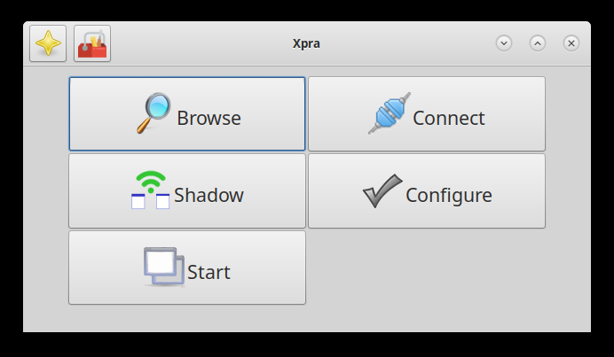
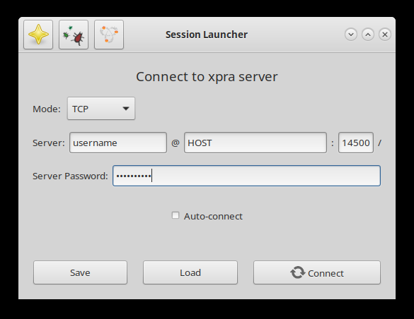
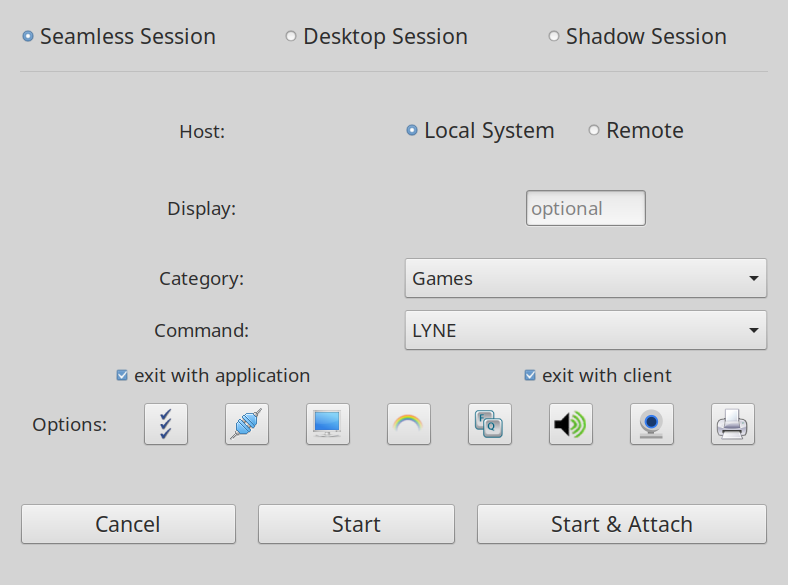
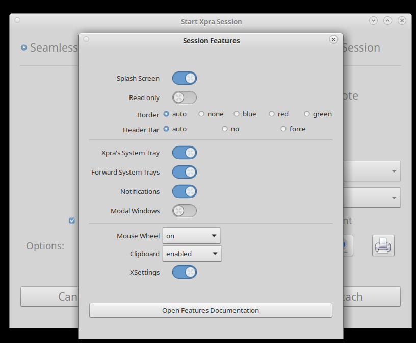
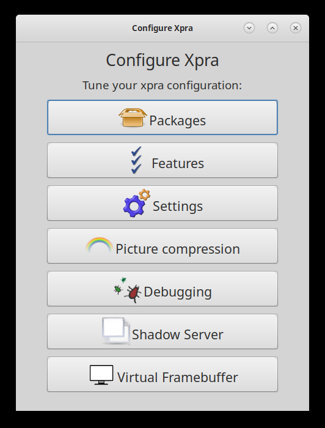

# Using Xpra

Xpra's graphical tools cover the most common ways to start, find, and connect
to sessions. Open **Xpra** from your desktop's application menu to get started,
or use the command-line examples below when you want a repeatable command or
more control.

<div class="docs-section-heading" markdown="1">

## Start with the graphical tools

Choose a task from the main Xpra window. Each tool focuses on one part of
setting up or using a session.

</div>

<div class="docs-grid docs-screenshot-grid" markdown="1">
<section class="docs-card docs-screenshot-card" markdown="1">

### Xpra main window

<a class="docs-screenshot-link" href="../images/screenshots/xpra-gui.png">

</a>

Your starting point for browsing available sessions, connecting to a server,
sharing an existing display, changing Xpra's configuration, or starting a new
session.

</section>

<section class="docs-card docs-screenshot-card" markdown="1">

### Connect to a session

<a class="docs-screenshot-link" href="../images/screenshots/xpra-launcher.png">

</a>

Use **Connect** to enter a server address and credentials. You can save the
connection to a session file so it is easy to reuse later. See the
[client guide](Client.md) for connection options.

</section>

<section class="docs-card docs-screenshot-card" markdown="1">

### Start a session

<a class="docs-screenshot-link" href="../images/screenshots/xpra-start.png">

</a>

Use **Start** to launch an application in a seamless session, create a full
desktop, or share an existing display. Sessions can run on this computer or a
remote host.

</section>

<section class="docs-card docs-screenshot-card" markdown="1">

### Choose session features

<a class="docs-screenshot-link" href="../images/screenshots/xpra-start-options.png">

</a>

The **Options** buttons in the Start window let you tailor clipboard sharing,
notifications, system tray forwarding, input handling, audio, printing, and
other [session features](../Features/README.md).

</section>

<section class="docs-card docs-screenshot-card docs-card-wide" markdown="1">

### Configure Xpra

<a class="docs-screenshot-link" href="../images/screenshots/xpra-configure.png">

</a>

Use **Configure** to change persistent defaults, check optional packages, tune
picture compression, enable debugging, and configure server components. These
settings can also be managed through [configuration files](Configuration.md).

</section>
</div>

<div class="docs-section-heading" markdown="1">

## Command-line examples

These examples apply to the [current versions](https://github.com/Xpra-org/xpra/wiki/Versions).
Use `man xpra` for the manual matching your installed version. On Microsoft
Windows, see the [Windows command line](Client.md#command-line).

</div>

<div class="docs-grid" markdown="1">
<section class="docs-card docs-card-wide" markdown="1">

### Simple [seamless](Seamless.md) application forwarding

This is how Xpra is most often used. This command starts `xterm` (or any
graphical application of your choice) on `HOST` and displays it on your local
desktop through an [SSH](../Network/SSH.md) transport:

```shell
xpra seamless ssh://USERNAME@HOST/ --start-child=xterm
```

<details markdown="1">
<summary>Step by step</summary>

Instead of starting and attaching to the session with a single command, first
connect to the server via SSH and start the Xpra server on a free display (`:100`
in this example):

```shell
xpra seamless :100 --start=xterm
```

Then connect to this Xpra instance from the client:

```shell
xpra attach ssh://USERNAME@HOST/100
```

Replace `HOST` with the hostname or IP address of the server.
</details>

<details markdown="1">
<summary>Connecting locally</summary>

If you are attaching from the same machine with the same user account, this is
sufficient:

```shell
xpra attach :100
```

If there is only one Xpra session running, omit the display:

```shell
xpra attach
```
</details>

<details markdown="1">
<summary>Access without SSH</summary>

SSH provides host verification, secure authentication, and encryption. It is
available on all platforms and is well tested.

If you do not want to give remote users shell access, or want to share sessions
between multiple remote users, you can use TCP sockets:

```shell
xpra seamless --start=xterm --bind-tcp=0.0.0.0:10000
```

Assuming port `10000` is allowed through the firewall, connect from the client
with:

```shell
xpra attach tcp://SERVERHOST:10000/
```

This example TCP socket is insecure. See [authentication](Authentication.md)
before exposing it to a network.
</details>

<details markdown="1">
<summary>Attach with a session file</summary>

Instead of typing the same attach command repeatedly, create a session file and
double-click it to connect:

```ini
mode=ssh
host=YOURSERVER
speaker=off
```

See [session files](Client.md#session-files) for more information.
</details>

</section>

<section class="docs-card" markdown="1">

### Forward a [full desktop](Desktop.md)

Start a full desktop environment with the [desktop](Desktop.md) mode:

```shell
xpra desktop --start-child=fluxbox
```

You can connect via SSH, TCP, or any other
[supported transport](../Network/README.md).

</section>

<section class="docs-card" markdown="1">

### Clone or [shadow](Shadow.md) an existing display

Access an existing display remotely:

```shell
xpra shadow ssh://SERVERHOST/
```

</section>

<section class="docs-card" markdown="1">

### Share the [clipboard](../Features/Clipboard.md)

Synchronize clipboard contents between the client and server while disabling
the other forwarded features:

```shell
xpra shadow --clipboard=yes --printing=no --windows=no --speaker=no ssh://SERVERHOST/
```

</section>

<section class="docs-card" markdown="1">

### Forward a [printer](../Features/Printing.md)

```shell
xpra shadow --printing=yes --windows=no --speaker=no ssh://SERVERHOST/
```

Local printers should then be available as virtual printers on the server.

</section>
</div>

<div class="docs-section-heading" markdown="1">

## More usage documentation

Go deeper into client options, performance, deployment, and troubleshooting.

</div>

<div class="docs-grid" markdown="1">
<section class="docs-card" markdown="1">

### Clients and configuration

- [Client](Client.md) — launch and configure the Xpra client
- [Client implementations](Clients.md) — compare the available clients
- [Configuration](Configuration.md) — use configuration files
- [Client OpenGL](Client-OpenGL.md) — improve client rendering performance

</section>

<section class="docs-card" markdown="1">

### Graphics and diagnostics

- [Server OpenGL](OpenGL.md) — run accelerated OpenGL applications
- [Picture encodings](Encodings.md) — tune encoding, including [NVENC](NVENC.md)
- [Logging](Logging.md) — enable logs for debugging
- [Security](Security.md) — harden an Xpra installation

</section>

<section class="docs-card" markdown="1">

### Deployment

- [Proxy server](Proxy-Server.md) — provide a single entry point
- [Apache proxy](Apache-Proxy.md) and [Nginx proxy](Nginx-Proxy.md)
- [Windows Subsystem for Linux](WSL.md)
- [Xdummy](Xdummy.md) — use the alternative virtual framebuffer

</section>
</div>
