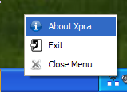

# Shadow mode

Shadow mode gives remote access to an existing display session. It is useful
when the applications are already running on a physical desktop and you need
to see or control that desktop remotely.

Shadowing is supported on Linux, macOS, and Windows. On most platforms, the
display must be active: it cannot be locked or turned off. Screen capture can
also use substantially more CPU on the server and client than a regular Xpra
session.

## Start and connect

<div class="docs-grid" markdown="1">
<section class="docs-card" markdown="1">

### SSH one-liner

If Xpra is installed on the remote host and you can log in with SSH, start and
attach to a temporary shadow server in one command:

```shell
xpra shadow ssh://HOST/
```

The shadow server stops when you disconnect. While it is running, it is also
available through its Unix-domain socket, for example:

```shell
xpra info ssh://HOST/DISPLAY
```

</section>

<section class="docs-card" markdown="1">

### Start from a shell

Start a persistent shadow server manually when you need to configure more
options. This example exposes the main display on TCP port `10000`:

```shell
xpra shadow :0 --bind-tcp=0.0.0.0:10000
```

On Windows and macOS there is no X11 display name such as `:0`, so omit the
display argument. You can also omit it when the system has only one active
`$DISPLAY`.

</section>
</div>

## Security and session selection

The TCP example above is intentionally minimal and does not provide
[authentication](Authentication.md) or [encryption](../Network/Encryption.md).
Configure both before exposing a shadow server beyond a trusted network.

Do not shadow an existing [seamless](Seamless.md) or
[desktop](Desktop.md) session when you can attach to that Xpra session directly.
Attaching preserves the session’s normal window and display handling and avoids
capturing the screen again.

## Diagnostics

Use `-d ssh` or another relevant category to enable
[debug logging](Logging.md). The shadow server also displays a system-tray
menu while it is running and changes its icon when a client connects.



For more general diagnostic steps, see [Debugging Xpra](../Debugging.md).

<details markdown="1">
<summary>Related issues</summary>

- [#899](https://github.com/Xpra-org/xpra/issues/899) generic shadow improvements
- [#389](https://github.com/Xpra-org/xpra/issues/389) Windows shadow server improvements
- [#558](https://github.com/Xpra-org/xpra/issues/558) NVENC support for shadowing on Windows
- [#390](https://github.com/Xpra-org/xpra/issues/390) damage events for the POSIX shadow server
- [#391](https://github.com/Xpra-org/xpra/issues/391) macOS shadow server improvements
- [#530](https://github.com/Xpra-org/xpra/issues/530) resize shadow windows on the client
- [#972](https://github.com/Xpra-org/xpra/issues/972) fullscreen mode in the Xpra client
- [#1099](https://github.com/Xpra-org/xpra/issues/1099) keyboard layout issue with the Windows shadow server
- [#1150](https://github.com/Xpra-org/xpra/issues/1150) named pipes for Windows
- [#1321](https://github.com/Xpra-org/xpra/issues/1321) scrolling with the macOS shadow server
- [#1322](https://github.com/Xpra-org/xpra/issues/1322) resizing the macOS shadow screen
</details>
