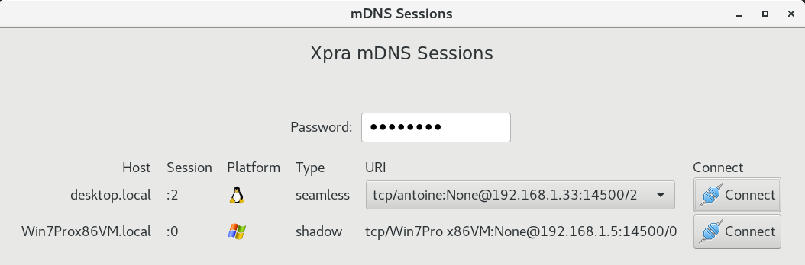

#  Multicast DNS

By default, the xpra server will advertise the session it creates on the local network using [Multicast DNS](https://en.wikipedia.org/wiki/Multicast_DNS).

To turn off this feature, use the `mdns=no` option.

## Usage
To view the list of sessions, run:\
   `xpra list-mdns`

To use the GUI mdns session launcher, run:\
   `xpra mdns-gui`

The user interface should look like this:

And you should be able to connect to those sessions simply by pressing the "connect" button.

## Limitations
* some features are only available in newer versions
* some platforms may not have the required libraries
* no IPv6 support: [#1345](https://github.com/Xpra-org/xpra/issues/1345)

## Links:
* [mdns service type](https://github.com/Xpra-org/xpra/issues/731)
* [mdns gui](https://github.com/Xpra-org/xpra/issues/1334)
* [mdns discovery](https://github.com/Xpra-org/xpra/issues/1332)
* [macos and win32 listener support](https://github.com/Xpra-org/xpra/issues/1333)
