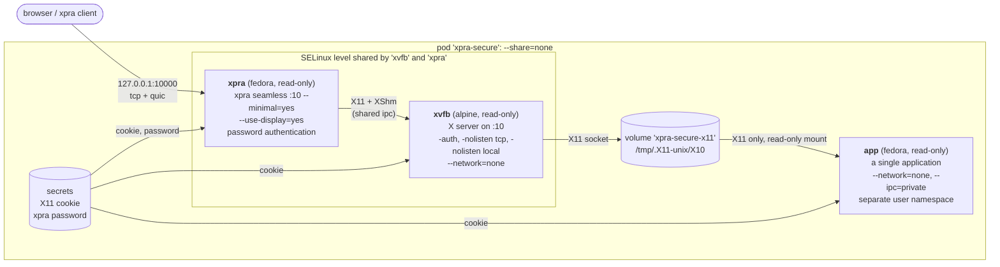

# Secure

A variant of the [split](../split/) pod for running an application which may be hostile:
everything that the application could use to reach the xpra server, the user's machine or the network is removed,
the only resource it shares with the other containers is the X11 display.

* `xvfb` runs the X server, the same image as the [split](../split/) pod
* `xpra` runs the xpra server, the same image as the [split](../split/) pod
* `app` runs a single application, built by [app.sh](./app.sh)

## Pod

The [pod](./pod.sh) script builds the images if they do not exist yet, creates a pod named `xpra-secure`,
and attempts to open a browser to access it, using the password generated for this session.

The pod is only used to manage the containers together, it does not share any namespaces (`--share=none`):



What the containers share:

| Resource | Owner | Used by | Notes |
|---|---|---|---|
| `xpra-secure-x11` volume | `xvfb` | `xpra` (read-write), `app` (read-only) | only contains the X11 socket, the `app` container can connect to it, but it cannot remove or replace it |
| ipc namespace | `xvfb` (`--ipc shareable`) | `xpra` | for `XShm` between the X server and xpra, the `app` container has its own ipc namespace and `/dev/shm`, so it cannot access their shared memory segments |
| X11 cookie | `pod.sh` | `xvfb`, `xpra`, `app` | generated for each session and given to the containers as a read-only podman secret, the X server does not accept clients without it |
| xpra password | `pod.sh` | `xpra` | generated for each session and only given to the `xpra` container as a podman secret, it is required to connect to the xpra server |
| SELinux level | `pod.sh` | `xvfb`, `xpra` | `xvfb` and `xpra` must use the same level to share `XShm` segments, the `app` container gets its own level from podman |

Nothing else is shared: there is no shared `/run` volume, session bus, audio server, runner socket or menu.

## Containers

All the containers run with a read-only root filesystem,
without any capabilities (`--cap-drop=all`), without privilege escalation (`--security-opt=no-new-privileges`), and with memory and process limits. \
The `xvfb` container starts as root only to switch to the X server's user, so it keeps the `SETUID` and `SETGID` capabilities,
which are lost once it has.

### xvfb

The X server does not have any network access (`--network=none`), and only listens on the socket in the shared volume:
not on `tcp`, and not on an abstract socket (`-nolisten local`). \
It only accepts clients which have the cookie (`--env XAUTH=...` uses `-auth` instead of `-ac`).

### xpra

The xpra server is started with `--minimal=yes`, which disables all the features which are not strictly required:
audio, clipboard, file transfers, printing, opening URLs, notifications, the system tray, dbus, starting new commands, sharing, mmap, etc. \
The features which are only used between the xpra server and its clients are re-enabled:
the HTML5 client (`--websocket-upgrade=yes`), cursors, the mouse wheel and the video encoders. \
It uses the display started by the `xvfb` container (`--use-display=yes`), and exits when the application's last window is closed (`--exit-with-windows=yes`). \
It runs as uid `1000`, its own sockets are in a private tmpfs, and its port is only published on `127.0.0.1`,
use `HOST_ADDRESS=0.0.0.0` to allow connections from other hosts. \
The connections must authenticate using the password generated by `pod.sh`.

The clipboard is disabled by default, use `CLIPBOARD=to-server` to allow the client to paste into the application,
or `to-client` and `both` to allow the application to copy to the client.

### app

The [app.sh](./app.sh) script builds a minimal image, without any xpra packages,
using `APP_PACKAGES` for the packages to install and `APP_COMMAND` for the command to run, `xterm` by default:
```shell
APP_PACKAGES="firefox" APP_COMMAND="firefox" ./app.sh
```
The application gets its own private session bus with `DBUS=1`, which is not shared with any other container.

The `app` container:
* has no network access, unless `APP_NETWORK=1`: the application then uses its own network, `xpra-secure-app`, not the one used by xpra
* has its own ipc namespace, so the application cannot access the `XShm` segments of the X server and xpra
* uses a separate user namespace: its uid `1000` is not the same user as the uid `1000` of the other containers
* mounts the X11 socket directory read-only, and only has the X11 cookie in `/run/secrets`
* has its home directory in a tmpfs, nothing it writes is kept

The `XShm` shared memory segments cannot be used by the application,
toolkits like GTK and Qt detect this and fall back to sending the pixels over the X11 socket.

## Limitations

These are some of the ways a hostile application can still affect the session:
* X11 does not isolate clients from each other: the application can read the contents of other windows, the input events (ie: using `RECORD` or `XInput2`) and inject input events (ie: using `XTEST`). \
  So only run applications which trust each other in the same pod. \
  The `RECORD` extension cannot be disabled: Xorg uses the same flag for `XTEST`, which xpra requires.
* the X server and xpra parse the requests and the window metadata sent by the application (titles, icons, hints),
  a vulnerability there could be exploited from the application.
  The X server runs in a container without any network access, but it can still reach xpra through X11 and the shared memory segments.
* the application controls its window titles and contents, it can impersonate other windows, ie: a password prompt.
  The server uses `--border=red,5` to draw a border around the windows of this session to make them easy to identify.
* with `APP_NETWORK=1`, the application can connect to the host, but not to the xpra port when it is only published on `127.0.0.1`.
* the containers share the host's kernel.

There is no start menu, and the application cannot be restarted from the client: restart the pod instead.
