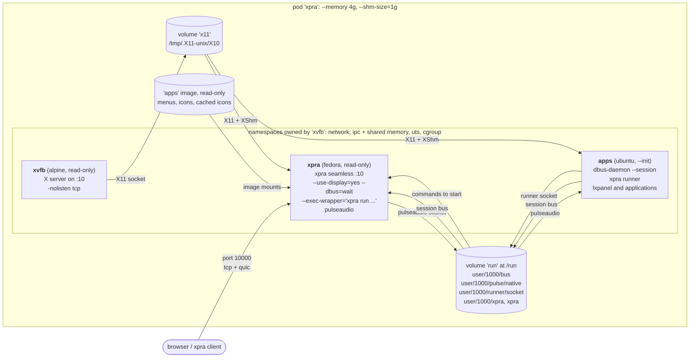
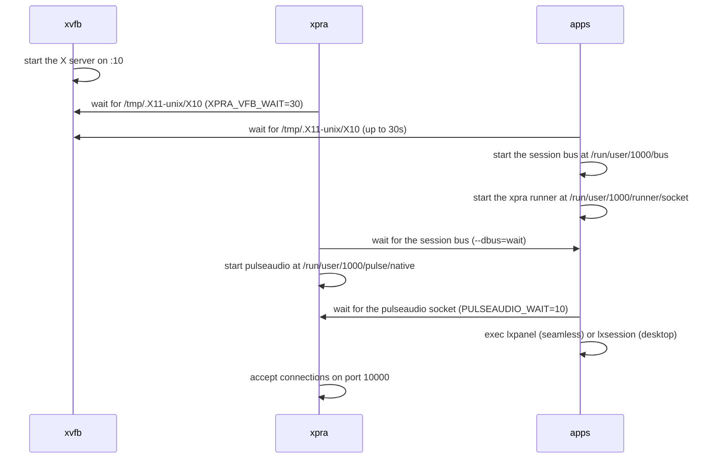

# Split Containers

Scripts for creating separate containers for the X11 virtual framebuffer, the xpra server and the applications, and running them together in a pod.

## [xvfb](./xvfb.sh) image

This container is typically used as part of a pod as it only provides an X11 virtual framebuffer. \
It is based on [alpinelinux](https://alpinelinux.org/) to keep things "_small, simple and secure_".

<details>
  <summary>configuration</summary>

This container does not need any kind of network access,
though it usually needs to share `ipc` and `network` with the xpra server and the X11 applications
so that they can enable `XShm` for performance.

[xvfb.sh](./xvfb.sh) will create a container named `xvfb`,
ready to start the virtual framebuffer on the display number specified.
</details>

<details>
  <summary>disk usage</summary>

This image takes up under 300MB of disk space.\

The biggest cost by far are the OpenGL libraries:
```shell
$ du -sm /usr/lib/* | tail -n 3
38	/usr/lib/libgallium-24.2.8.so
43	/usr/lib/gallium-pipe
154	/usr/lib/libLLVM.so.19.1
```
If none of the applications will be using OpenGL, these can be omitted by running the script with:
```shell
OPENGL=0 ./xvfb.sh
```
</details>


## [xpra](./xpra.sh)

This container runs the xpra server and may use an existing `xvfb` if one is already started. \
This default image configuration is based on [fedora](https://fedoraproject.org/),
but [almalinux](https://almalinux.org/) or [rockylinux](https://rockylinux.org/) can also be used with the same script.

Applications may be added here, or to a separate container.

<details>
  <summary>disk usage</summary>

This image takes up 1GB of disk space.

The biggest cost by far are the media libraries: GStreamer, pulseaudio and the video codecs. \
To remove them, run the script with:
```shell
AUDIO=0 CODECS=0 ./xpra.sh
```
</details>

## [desktop](./desktop.sh)

This container runs a lightweight desktop environment based on `LXDE`.  \
The default image configuration is based on [Ubuntu Resolute Raccoon](https://releases.ubuntu.com/resolute/),
but other Debian and Ubuntu releases can also be used.

## Pod

The [pod](./pod.sh) script uses the containers created above to provide an xpra session.
It will also attempt to open a browser to access it

All three containers run their processes as uid `1000`, and the `xpra` and `apps` containers join the namespaces of the `xvfb` container:



Shared resources:

| Resource | Owner | Used by | Notes |
|---|---|---|---|
| network namespace | `xvfb` | `xpra`, `apps` | the pod is reached through `xvfb`, which publishes port `10000` (`tcp` and `udp` for `quic`) on the `publicnet` network, the xpra server listens on it |
| ipc namespace | `xvfb` (`--ipc shareable`) | `xpra`, `apps` | required for `XShm`: the X server, xpra and the applications exchange pixel data using SysV shared memory segments, `/dev/shm` is also shared and sized by the pod's `--shm-size` |
| uts namespace | `xvfb` | `xpra`, `apps` | all three containers use the same hostname: `xpra` |
| `x11` volume | `xvfb` | `xpra`, `apps` (`--volumes-from`) | only the X11 socket directory is shared, each container keeps its own private `/tmp`, the X server does not listen on `tcp` |
| `run` volume | `xpra` | `apps` (`--volumes-from`) | populated from the `xpra` image, which pre-creates `/run/user/1000`, it contains the session bus, the pulseaudio socket and the xpra sockets |
| session bus | `apps` | `xpra` | runs in `apps` so that dbus activation starts services where the applications are installed, xpra connects to it with `--dbus=wait` |
| system bus | none | | xpra does not start one (`XPRA_SYSTEM_DBUS=0`), nothing in the pod needs it |
| runner socket | `apps` | `xpra` | the `xpra runner` started in `apps` listens on `/run/user/1000/runner/socket`, in a directory which only uid `1000` can access, and xpra starts all the commands through it (`--exec-wrapper`) so that they run where the applications are installed, the OpenGL probe would also go through it, so it is skipped (`--opengl=noprobe`) |
| menus and icons | `apps` image | `xpra` | mounted read-only (`--mount type=image`) at the same locations: the menu definitions, the `.desktop` files, the icons, and the SVG icons cached as PNG when the image is built, in `/var/cache/xpra/menu-icons` |
| pulseaudio | `xpra` | `apps` | started by xpra once the session bus is available, the applications use the socket at `/run/user/1000/pulse/native` |

The containers start in parallel, so each one waits for the resources it needs:



Known limitation: xpra starts the commands using `xpra run`, which exits as soon as the runner has started the command, so xpra cannot track the processes: `start-child`, `exit-with-children` and the per-client window filtering of commands that are not shared do not work.
