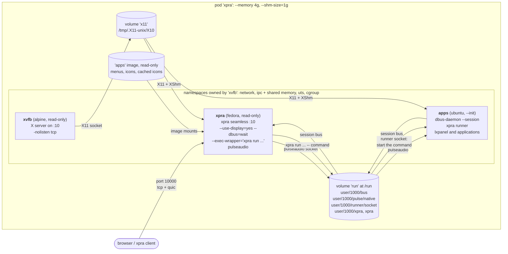
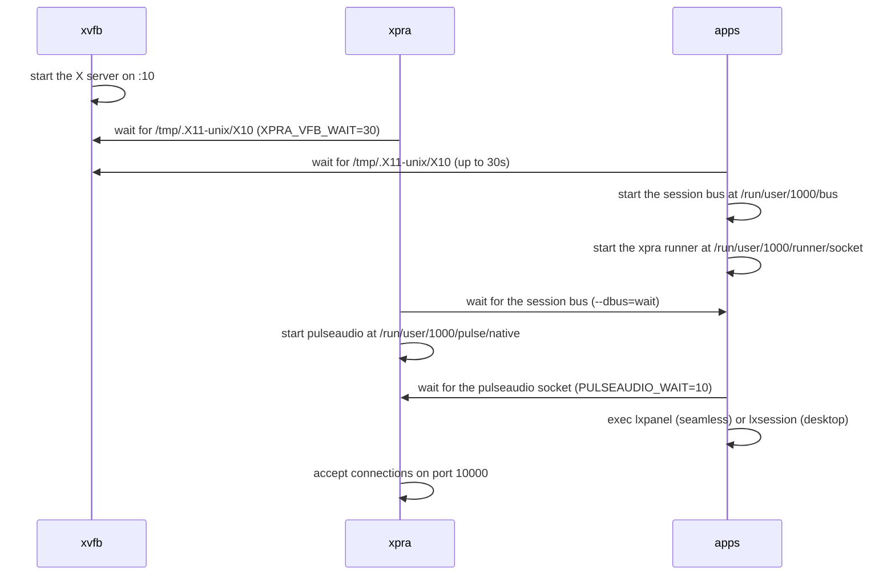
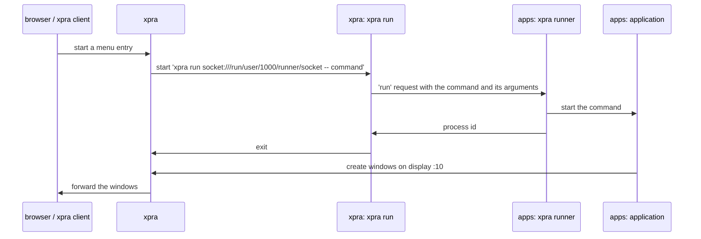

# Split Containers

Scripts for creating separate containers for the X11 virtual framebuffer, the xpra server and the applications, and running them together in a pod.

## [xvfb](./xvfb.sh) image

This container is typically used as part of a pod as it only provides an X11 virtual framebuffer. \
It is based on [alpinelinux](https://alpinelinux.org/) to keep things "_small, simple and secure_".

<details>
  <summary>configuration</summary>

This container does not need any kind of network access,
though it usually needs to share `ipc` and `network` with the xpra server and the X11 applications
so that they can enable `XShm` for performance.

[xvfb.sh](./xvfb.sh) will create a container named `xvfb`,
ready to start the virtual framebuffer on the display number specified.
By default, the X server accepts all the clients which can connect to its socket (`-ac`),
`--env XAUTH=/path/to/Xauthority` enables access control using the cookies from this file instead,
and `--env XARGS=...` adds more arguments to the X server command line, see the [secure](../secure/) pod.
</details>

<details>
  <summary>disk usage</summary>

This image takes up under 300MB of disk space.\

The biggest cost by far are the OpenGL libraries:
```shell
$ du -sm /usr/lib/* | tail -n 3
38	/usr/lib/libgallium-24.2.8.so
43	/usr/lib/gallium-pipe
154	/usr/lib/libLLVM.so.19.1
```
If none of the applications will be using OpenGL, these can be omitted by running the script with:
```shell
OPENGL=0 ./xvfb.sh
```
</details>


## [xpra](./xpra.sh)

This container runs the xpra server and may use an existing `xvfb` if one is already started. \
This default image configuration is based on [fedora](https://fedoraproject.org/),
but [almalinux](https://almalinux.org/) or [rockylinux](https://rockylinux.org/) can also be used with the same script.

Applications may be added here, or to a separate container: the [pod](./pod.sh) uses the `apps` container, see [starting applications](#starting-applications).

<details>
  <summary>disk usage</summary>

This image takes up 1GB of disk space.

The biggest cost by far are the media libraries: GStreamer, pulseaudio and the video codecs. \
To remove them, run the script with:
```shell
AUDIO=0 CODECS=0 ./xpra.sh
```
</details>

## [desktop](./desktop.sh)

This container runs a lightweight desktop environment based on `LXDE`.  \
The default image configuration is based on [Ubuntu Resolute Raccoon](https://releases.ubuntu.com/resolute/),
but other Debian and Ubuntu releases can also be used. \
[desktop-fedora.sh](./desktop-fedora.sh) builds the same image based on Fedora. \
It also runs the `xpra runner`, which starts the applications requested by the xpra server.

## Pod

The [pod](./pod.sh) script uses the containers created above to provide an xpra session.
It will also attempt to open a browser to access it

All three containers run their processes as uid `1000`, and the `xpra` and `apps` containers join the namespaces of the `xvfb` container:



Shared resources:

| Resource | Owner | Used by | Notes |
|---|---|---|---|
| network namespace | `xvfb` | `xpra`, `apps` | the pod is reached through `xvfb`, which publishes port `10000` (`tcp` and `udp` for `quic`) on the `publicnet` network, the xpra server listens on it |
| ipc namespace | `xvfb` (`--ipc shareable`) | `xpra`, `apps` | required for `XShm`: the X server, xpra and the applications exchange pixel data using SysV shared memory segments, `/dev/shm` is also shared and sized by the pod's `--shm-size` |
| uts namespace | `xvfb` | `xpra`, `apps` | all three containers use the same hostname: `xpra` |
| `x11` volume | `xvfb` | `xpra`, `apps` (`--volumes-from`) | only the X11 socket directory is shared, each container keeps its own private `/tmp`, the X server does not listen on `tcp` |
| `run` volume | `xpra` | `apps` (`--volumes-from`) | populated from the `xpra` image, which pre-creates `/run/user/1000`, it contains the session bus, the pulseaudio socket and the xpra sockets |
| session bus | `apps` | `xpra` | runs in `apps` so that dbus activation starts services where the applications are installed, xpra connects to it with `--dbus=wait` |
| system bus | none | | xpra does not start one (`XPRA_SYSTEM_DBUS=0`), nothing in the pod needs it |
| runner socket | `apps` | `xpra` | the `xpra runner` started in `apps` listens on `/run/user/1000/runner/socket`, in a directory which only uid `1000` can access, xpra uses it to start the applications in `apps`, see [starting applications](#starting-applications) |
| menus and icons | `apps` image | `xpra` | mounted read-only (`--mount type=image`) at the same locations: the menu definitions, the `.desktop` files, the icons, and the SVG icons cached as PNG when the image is built, in `/var/cache/xpra/menu-icons`, see [menus](#menus) |
| pulseaudio | `xpra` | `apps` | started by xpra once the session bus is available, the applications use the socket at `/run/user/1000/pulse/native` |

The containers start in parallel, so each one waits for the resources it needs:



## Starting applications

The applications are only installed in the `apps` image, the `xpra` image does not contain any. \
xpra still provides the start menu, and starts the applications in the `apps` container when they are requested.

### Menus

The xpra server loads the menu definitions, the `.desktop` files and the icons from the `apps` image,
which the [pod](./pod.sh) script mounts read-only in the `xpra` container at the same locations (`--mount type=image`):
`/etc/xdg/menus`, `/usr/share/applications`, `/usr/share/desktop-directories`, `/usr/share/icons` and `/usr/share/pixmaps`. \
xpra converts the SVG icons to PNG before sending them to the clients, but it cannot write to these mounts,
so [desktop.sh](./desktop.sh) runs `xpra menu-cache` when it builds the image: the converted icons are saved in `/var/cache/xpra/menu-icons`, which is mounted too. \
The mounts come from the image and not from the running `apps` container:
applications installed in the container at runtime do not show up in the menu, add them to the image instead.

### Commands

The `apps` container runs an `xpra runner`: an xpra server which only starts commands, without any display, menu, control channel or network socket. \
It listens on `/run/user/1000/runner/socket`, in the shared `/run` volume, and the xpra server is started with
`--exec-wrapper="xpra run socket:///run/user/1000/runner/socket --"`, so the runner executes every command xpra starts:



The wrapper applies to all the commands that xpra starts:
the `start` and `start-child` options, the commands started when a client connects or when the last client exits,
the start menu, `xpra control :10 start ...` and the other requests to start new commands. \
It does not apply to the services which xpra starts for itself and which must run in the `xpra` container:
pulseaudio, the input method (`ibus`) and, in the [xpra-apps](../xpra-apps/) pod, the X server. \
The OpenGL probe would also go through the wrapper, and probe the `apps` container instead of the `xpra` container,
so it is skipped (`--opengl=noprobe`).

The commands run with the environment of the runner, which is the one set by the `apps` container's entrypoint:
`DISPLAY=:10`, `XAUTHORITY`, `XDG_RUNTIME_DIR` and `DBUS_SESSION_BUS_ADDRESS` for the session bus. \
The environment of the xpra server, including `--start-env`, is not passed on.

The [xpra](./xpra.sh) image installs `xpra-client` for the `xpra run` command,
and the [apps](./desktop.sh) image only installs the `xpra-server` package for the runner, without any of the packages it recommends. \
To build an `apps` image without the runner, use `RUNNER=0`:
the xpra server can then only start the applications installed in the `xpra` image,
and the `EXEC_WRAPPER` and `OPENGL` variables must be removed from the [pod](./pod.sh) script.

### Security

Anything which can connect to the runner socket can start any command as uid `1000` in the `apps` container. \
The socket is in a directory which only uid `1000` can access, and the processes of both containers already run as uid `1000`. \
The runner does not listen on any network socket, and does not accept socket upgrades (`--ssh-upgrade=no`) or control commands. \
The xpra server's own `start-new-commands` option still decides whether its clients are allowed to start commands. \
The session bus is owned by the `apps` container, so the xpra server does not expose its control interface there (`--dbus-control=no`),
which would otherwise let any process connected to the bus start commands or change the server settings.

### Limitations

`xpra run` exits as soon as the runner has started the command, so xpra cannot track the processes:
`start-child`, `exit-with-children` and the per-client window filtering of commands that are not shared do not work.
