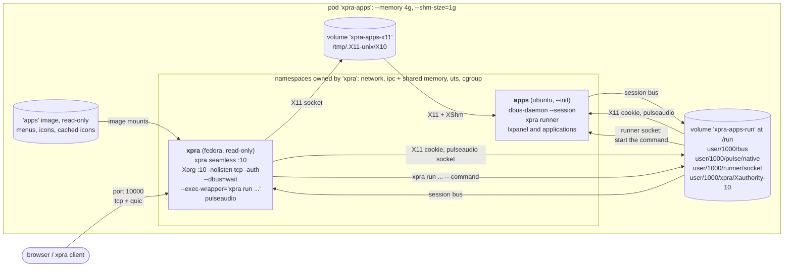
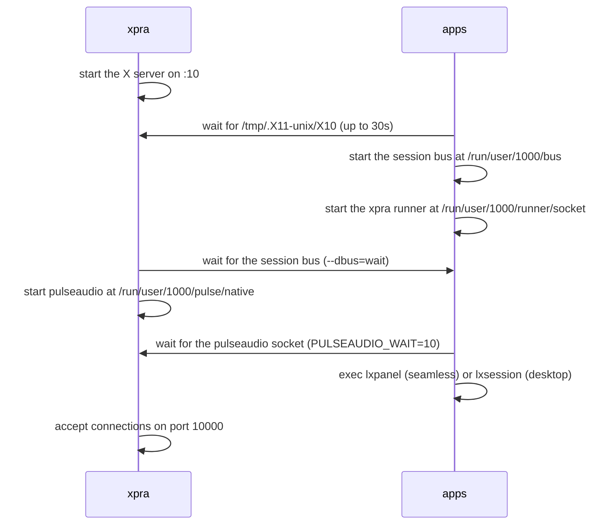
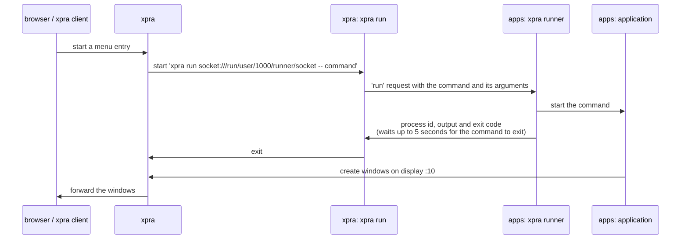

# xpra + apps

A simpler variant of the [split](../split/) pod, with only two containers:
* `xpra` runs the xpra server, which also starts the X server
* `apps` runs the desktop environment and the applications

The images are the same `xpra` and `apps` images used by the split pod, the [pod](./pod.sh) script builds them using the [split](../split/) scripts if they do not exist yet. \
Compared to the split pod, there is no `xvfb` image to build and no waiting for an X server provided by another container,
but the X server can no longer outlive the xpra server.

## Pod

The [pod](./pod.sh) script creates a pod named `xpra-apps` and attempts to open a browser to access it.

Both containers run their processes as uid `1000`, and the `apps` container joins the namespaces of the `xpra` container:

Shared resources:

| Resource | Owner | Used by | Notes |
|---|---|---|---|
| network namespace | `xpra` | `apps` | `xpra` publishes port `10000` (`tcp` and `udp` for `quic`) on the `publicnet` network |
| ipc namespace | `xpra` (`--ipc shareable`) | `apps` | required for `XShm`: the X server, xpra and the applications exchange pixel data using SysV shared memory segments, `/dev/shm` is also shared and sized by the pod's `--shm-size` |
| uts namespace | `xpra` | `apps` | both containers use the same hostname: `xpra`, which the X11 authorization cookie is bound to |
| `xpra-apps-x11` volume | `xpra` | `apps` (`--volumes-from`) | populated from the `xpra` image, which creates `/tmp/.X11-unix` with mode `1777` so that the X server can create its socket there |
| `xpra-apps-run` volume | `xpra` | `apps` (`--volumes-from`) | populated from the `xpra` image, which pre-creates `/run/user/1000`, it contains the session bus, the pulseaudio socket, the xpra sockets and the X11 authorization cookie |
| X11 authorization | `xpra` | `apps` | unlike the `xvfb` container, xpra starts the X server with `-auth`, the applications use the cookie from `/run/user/1000/xpra/Xauthority-10` |
| session bus | `apps` | `xpra` | runs in `apps` so that dbus activation starts services where the applications are installed, xpra connects to it with `--dbus=wait` |
| system bus | none | | xpra does not start one (`XPRA_SYSTEM_DBUS=0`), nothing in the pod needs it |
| runner socket | `apps` | `xpra` | the `xpra runner` started in `apps` listens on `/run/user/1000/runner/socket`, in a directory which only uid `1000` can access, xpra uses it to start the applications in `apps`, see [starting applications](#starting-applications) |
| menus and icons | `apps` image | `xpra` | mounted read-only (`--mount type=image`) at the same locations: the menu definitions, the `.desktop` files, the icons, and the SVG icons cached as PNG when the image is built, in `/var/cache/xpra/menu-icons`, see [menus](#menus) |
| pulseaudio | `xpra` | `apps` | started by xpra once the session bus is available, the applications use the socket at `/run/user/1000/pulse/native` |

The containers start in parallel, so each one waits for the resources it needs:

## Starting applications

The applications are only installed in the `apps` image, the `xpra` image does not contain any. \
xpra still provides the start menu, and starts the applications in the `apps` container when they are requested.

### Menus

The xpra server loads the menu definitions, the `.desktop` files and the icons from the `apps` image,
which the [pod](./pod.sh) script mounts read-only in the `xpra` container at the same locations (`--mount type=image`):
`/etc/xdg/menus`, `/usr/share/applications`, `/usr/share/desktop-directories`, `/usr/share/icons` and `/usr/share/pixmaps`. \
xpra converts the SVG icons to PNG before sending them to the clients, but it cannot write to these mounts,
so [desktop.sh](../split/desktop.sh) runs `xpra menu-cache` when it builds the image: the converted icons are saved in `/var/cache/xpra/menu-icons`, which is mounted too. \
The mounts come from the image and not from the running `apps` container:
applications installed in the container at runtime do not show up in the menu, add them to the image instead.

### Commands

The `apps` container runs an `xpra runner`: an xpra server which only starts commands, without any display, menu, control channel or network socket. \
It listens on `/run/user/1000/runner/socket`, in the shared `/run` volume, and the xpra server is started with
`--exec-wrapper="xpra run socket:///run/user/1000/runner/socket --"`, so the runner executes every command xpra starts:

The wrapper applies to all the commands that xpra starts:
the `start` and `start-child` options, the commands started when a client connects or when the last client exits,
the start menu, `xpra control :10 start ...` and the other requests to start new commands. \
It does not apply to the services which xpra starts for itself and which must run in the `xpra` container:
pulseaudio, the input method (`ibus`) and, the X server. \
The OpenGL probe also goes through the wrapper, so it tests OpenGL in the `apps` container, where the applications use it. \
`xpra run` waits for the probe to complete and returns its output and exit code to the xpra server,
which reports the result as usual.

The commands run with the environment of the runner, which is the one set by the `apps` container's entrypoint:
`DISPLAY=:10`, `XAUTHORITY`, `XDG_RUNTIME_DIR` and `DBUS_SESSION_BUS_ADDRESS` for the session bus. \
The environment of the xpra server, including `--start-env`, is not passed on.

The [xpra](../split/xpra.sh) image installs `xpra-client` for the `xpra run` command,
and the [apps](../split/desktop.sh) image installs the `xpra-server` package for the runner, without any of the packages it recommends,
plus the packages needed to run the OpenGL probe: `xpra-client-gtk3`, `xpra-x11`, PyOpenGL and the mesa drivers. \
To build an `apps` image without the OpenGL probe packages, use `OPENGL=0`, and add `--env OPENGL=noprobe` to the xpra container in the [pod](./pod.sh) script. \
To build an `apps` image without the runner, use `RUNNER=0`:
the xpra server can then only start the applications installed in the `xpra` image,
and the `EXEC_WRAPPER` variable must be removed from the [pod](./pod.sh) script.

### Security

Anything which can connect to the runner socket can start any command as uid `1000` in the `apps` container. \
The socket is in a directory which only uid `1000` can access, and the processes of both containers already run as uid `1000`. \
The runner does not listen on any network socket, and does not accept socket upgrades (`--ssh-upgrade=no`) or control commands. \
The xpra server's own `start-new-commands` option still decides whether its clients are allowed to start commands. \
The session bus is owned by the `apps` container, so the xpra server does not expose its control interface there (`--dbus-control=no`),
which would otherwise let any process connected to the bus start commands or change the server settings.

### Limitations

`xpra run` exits when the command does, or after 5 seconds while the command keeps running in the `apps` container, so xpra cannot track the processes:
`start-child`, `exit-with-children` and the per-client window filtering of commands that are not shared do not work.

Known limitation: the session bus runs in the `apps` container: if this container is restarted, xpra loses its connection to the bus.
