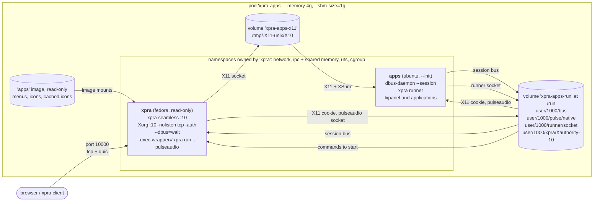
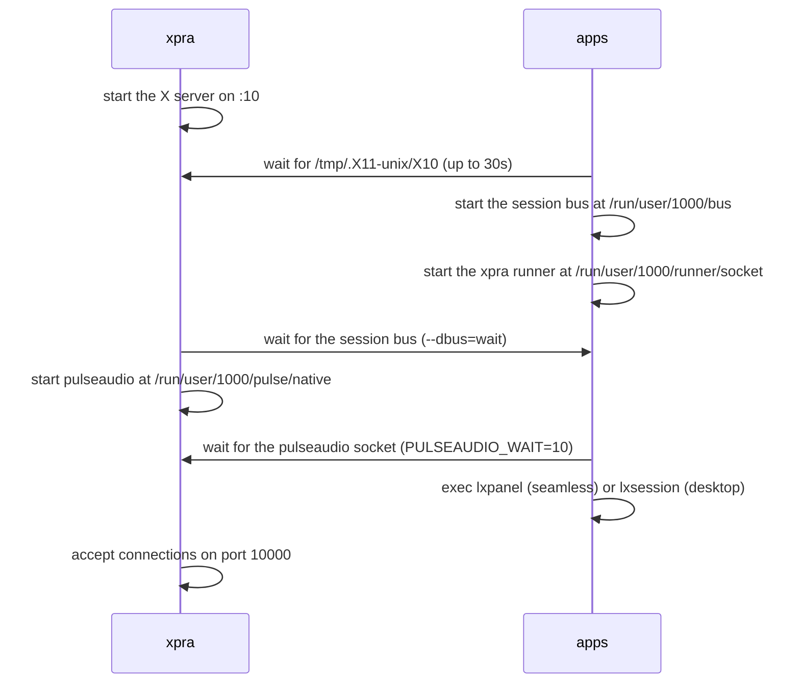

# xpra + apps

A simpler variant of the [split](../split/) pod, with only two containers:
* `xpra` runs the xpra server, which also starts the X server
* `apps` runs the desktop environment and the applications

The images are the same `xpra` and `apps` images used by the split pod, the [pod](./pod.sh) script builds them using the [split](../split/) scripts if they do not exist yet. \
Compared to the split pod, there is no `xvfb` image to build and no waiting for an X server provided by another container,
but the X server can no longer outlive the xpra server.

## Pod

The [pod](./pod.sh) script creates a pod named `xpra-apps` and attempts to open a browser to access it.

Both containers run their processes as uid `1000`, and the `apps` container joins the namespaces of the `xpra` container:

Shared resources:

| Resource | Owner | Used by | Notes |
|---|---|---|---|
| network namespace | `xpra` | `apps` | `xpra` publishes port `10000` (`tcp` and `udp` for `quic`) on the `publicnet` network |
| ipc namespace | `xpra` (`--ipc shareable`) | `apps` | required for `XShm`: the X server, xpra and the applications exchange pixel data using SysV shared memory segments, `/dev/shm` is also shared and sized by the pod's `--shm-size` |
| uts namespace | `xpra` | `apps` | both containers use the same hostname: `xpra`, which the X11 authorization cookie is bound to |
| `xpra-apps-x11` volume | `xpra` | `apps` (`--volumes-from`) | populated from the `xpra` image, which creates `/tmp/.X11-unix` with mode `1777` so that the X server can create its socket there |
| `xpra-apps-run` volume | `xpra` | `apps` (`--volumes-from`) | populated from the `xpra` image, which pre-creates `/run/user/1000`, it contains the session bus, the pulseaudio socket, the xpra sockets and the X11 authorization cookie |
| X11 authorization | `xpra` | `apps` | unlike the `xvfb` container, xpra starts the X server with `-auth`, the applications use the cookie from `/run/user/1000/xpra/Xauthority-10` |
| session bus | `apps` | `xpra` | runs in `apps` so that dbus activation starts services where the applications are installed, xpra connects to it with `--dbus=wait` |
| system bus | none | | xpra does not start one (`XPRA_SYSTEM_DBUS=0`), nothing in the pod needs it |
| runner socket | `apps` | `xpra` | the `xpra runner` started in `apps` listens on `/run/user/1000/runner/socket`, in a directory which only uid `1000` can access, and xpra starts all the commands through it (`--exec-wrapper`) so that they run where the applications are installed, the OpenGL probe would also go through it, so it is skipped (`--opengl=noprobe`) |
| menus and icons | `apps` image | `xpra` | mounted read-only (`--mount type=image`) at the same locations: the menu definitions, the `.desktop` files, the icons, and the SVG icons cached as PNG when the image is built, in `/var/cache/xpra/menu-icons` |
| pulseaudio | `xpra` | `apps` | started by xpra once the session bus is available, the applications use the socket at `/run/user/1000/pulse/native` |

The containers start in parallel, so each one waits for the resources it needs:

Known limitations:
* xpra starts the commands using `xpra run`, which exits as soon as the runner has started the command, so xpra cannot track the processes: `start-child`, `exit-with-children` and the per-client window filtering of commands that are not shared do not work
* the session bus runs in the `apps` container: if this container is restarted, xpra loses its connection to the bus
